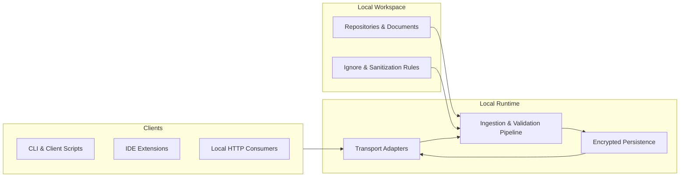

# EmbedNexus

## Mission
- Deliver a local-first embedding management platform that accelerates retrieval-augmented workflows without relying on external services.
- Provide deterministic ingestion across mixed repositories while preserving governance, auditability, and the 4C documentation standard.
- Empower developers with tooling that integrates seamlessly into existing CLI, IDE, and automation pipelines.

## Architecture at a Glance

- Local transports (HTTP, stdio, and Unix domain sockets) keep traffic on-device while supporting diverse client scenarios.
- The ingestion pipeline enforces ignore policies, sanitizes inputs, and streams embeddings into encrypted storage.
- Encrypted persistence and manifest auditing provide reproducible state across multi-repository environments.

## Security Posture
- Encrypted stores are backed by per-repository keys and audited manifest chains to prevent tampering and rollback attacks.
- Transport adapters enforce authentication, input validation, and zero-trust defaults for CLI, IDE, and automation clients.
- Threat modeling, mitigation tracking, and checklist completion are mandated for every change; reference [`docs/security/threat-model.md`](docs/security/threat-model.md).

## Contributor Workflow Essentials
- **Plan before code:** Draft and circulate an implementation plan before touching source files, per [`AGENTS.md`](AGENTS.md).
- **Test-driven development (TDD):** Capture expected behavior in failing tests ahead of implementation and keep regression suites green.
- **Documentation discipline:** Maintain 4C compliance—ensure updates are clear, concise, complete, and correct, and synchronize README and related docs with feature changes.
- **Release readiness:** Run `rustfmt`, `cargo clippy --all-targets --all-features`, and complete the [PR release checklist](docs/process/pr-release-checklist.md) before requesting review.

## Documentation Map
- **Design Overview:** Architectural context, ingestion pipeline details, and transport adapters in [`docs/design/overview.md`](docs/design/overview.md).
- **Testing Strategy:** Platform and scenario coverage in [`docs/testing/test-matrix.md`](docs/testing/test-matrix.md).
- **Security Guidance:** Threat modeling reference and controls in [`docs/security/threat-model.md`](docs/security/threat-model.md).
- **Process & Governance:** Contribution governance, decision logs, and release workflow in [`docs/process/`](docs/process/).
- **Fixture Tooling:** Multi-language script stubs, runtime requirements, and linting expectations in [`scripts/README.md`](scripts/README.md).

## Fixture Generation Tooling

The [`scripts/`](scripts/) directory now hosts descriptive stubs for the tooling
referenced throughout [`docs/testing/fixtures-plan.md`](docs/testing/fixtures-plan.md)
and [`docs/testing/ci-coverage.md`](docs/testing/ci-coverage.md). Each placeholder
captures its intended responsibilities plus the runtimes and third-party
dependencies required to regenerate fixtures across Windows, macOS, Linux, and
WSL environments.

When implementing these utilities:

- Follow the linting and formatting expectations documented in
  [`scripts/README.md`](scripts/README.md) (`ruff`/`black` for Python, `rustfmt`/
  `clippy` for Rust, `shfmt`/`shellcheck` for shell, and `PSScriptAnalyzer` for
  PowerShell).
- Document new configuration switches or host prerequisites directly in the
  script docstrings and associated fixture READMEs to keep regeneration guidance
  complete.
- Update CI workflows to invoke the appropriate linters once the scripts move
  beyond placeholder status.

## Automated Fixture & Golden Regeneration Workflows

Two GitHub Actions workflows codify the regeneration sequences documented in the
fixture management plan:

- **Regenerate Fixture Corpus** (`.github/workflows/regenerate-fixtures.yml`) sets
  up Python 3.11, installs the documented dependencies (`watchdog`, `pyyaml`,
  `typer`, `rich`, `click`, `cryptography`, `networkx`), and primes the stable
  Rust toolchain before invoking each fixture-generation script. The workflow
  uploads the refreshed `tests/fixtures/` tree and fixture-adjacent goldens as a
  short-lived artifact (`fixture-regeneration-output`) so reviewers can download
  and inspect the regenerated assets.
- **Regenerate Golden Artifacts** (`.github/workflows/regenerate-goldens.yml`)
  mirrors the environment bootstrap and focuses on transcripts and logs under
  `tests/golden/`, publishing the `golden-regeneration-output` artifact with the
  captured results.

Both workflows expose a manual `workflow_dispatch` trigger with two optional
inputs:

1. `dry_run=true` validates that the required toolchains install cleanly without
   executing the placeholder scripts.
2. `skip_artifact_upload=true` is available when local testing already captured
   the artifacts and the Actions run should avoid storing duplicates.

Because the scripts remain placeholders, each step detects the "Placeholder"
markers and converts the generation command into a logged no-op. Once the CLI
tools are implemented the guards fall away automatically, enabling full
regeneration without editing the workflows. The checksum verification step
similarly skips execution while `scripts/checksums.sh` is unimplemented; removing
the placeholder will automatically turn on the `--verify` calls for both
fixtures and goldens.

Each workflow also includes a Windows runner job that emits manual instructions
for DPAPI recovery and WSL handshake captures. Contributors must follow
[`docs/testing/fixtures-plan.md`](docs/testing/fixtures-plan.md) to produce those
artifacts on a domain-joined host and upload them to the corresponding workflow
run before completion. Reference the Actions artifacts when updating fixture
README files or the test matrix to maintain traceability.

## Upcoming Client & IDE Resources
- Client integration patterns and validated scripts will land in [`docs/integration/clients.md`](docs/integration/clients.md); watch for connector templates and signing guidance.
- IDE and editor onboarding lives in [`docs/integration/ide-overview.md`](docs/integration/ide-overview.md), which will link to language-specific SDKs and Marketplace packages as they are published.
- A starter toolkit (CLI wrappers, VS Code tasks, and JetBrains run configurations) will ship alongside the integration docs so new contributors can bootstrap local testing quickly.

## Getting Started
1. Review the design, security, testing, and process documentation.
2. Draft your implementation plan and secure consensus before writing code.
3. Implement features with TDD, run the required linters, and document changes following the 4C standard.
