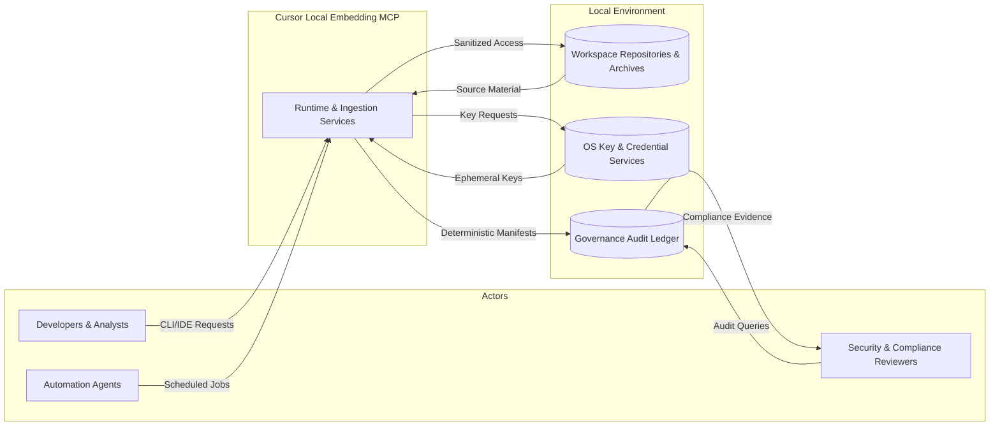

# Level 1 — System Context

The Cursor Local Embedding MCP delivers an offline-first runtime that ingests source material from developer workspaces, produces privacy-preserving vector embeddings, and exposes the resulting search surface to trusted local clients. This context view summarizes the system boundary, the actors that interact with it, and the adjacent platforms that constrain security, governance, and operational outcomes.

## System Scope and Boundaries
- **Primary purpose** — Maintain a local-only embedding and retrieval service that honors workspace ignore policies while supporting deterministic replay, as documented in the [architecture overview](../../overview.md) and expanded in the [Ingestion Pipeline Specification](../../ingestion.md).
- **Runtime boundary** — The MCP runtime executes entirely on the contributor's workstation (Linux, macOS, or WSL) and owns the ingestion pipeline, transport adapters, encryption services, and manifest governance described across the subsystem specs.
- **External dependencies** — The system relies on local repository storage, OS-native key management (including DPAPI via WSL shims), and operator-managed audit ledgers; any cloud service interaction is optional and never required for core ingestion or query flows.
- **Trust zones** — Clients authenticate to the runtime over loopback transports, and all persisted embeddings remain within encrypted stores controlled by the operator. Audit trails provide cross-cutting traceability back to governance requirements.

## Primary Actors and External Systems
| Actor | Goals | Interfaces | Notes |
| --- | --- | --- | --- |
| Developers & Analysts | Trigger ingestion, query embeddings, manage workspace policies | CLI tooling, IDE extensions, local HTTP endpoints | Must receive deterministic feedback on ingest status, chunk lineage, and search results while operating offline. |
| Automation Agents | Schedule background indexing, orchestrate repository onboarding, capture telemetry for governance | Automation scripts over STDIO/UDS, manifest replay harness | Governed by the [Offline Queue & Replay Harnesses](../../../testing/fixtures-plan.md#offline-queue--replay-harnesses) expectations for deterministic retries. |
| Security & Compliance Reviewers | Validate audit trails, enforce encryption and sandboxing policies, confirm governance evidence | Audit ledger exports, governance log, traceability index | Map runtime behavior to the [Architecture Traceability Index](../../traceability.md#traceability-map) and security checklists referenced in subsystem specs. |
| Local Workspace Sources | Provide repositories, archives, and ignore rule stacks | File system, archive staging areas | Boundaries defined in the [Vector Store Specification](../../vector-store.md) and [Ingestion Pipeline Specification](../../ingestion.md) to guarantee deterministic manifests. |
| OS Key & Credential Services | Issue secrets for encryption and transport authentication | DPAPI (WSL), macOS Keychain, Linux keyrings | Requirements traced through the [Encryption Engine Specification](../../encryption.md) and corresponding checklists. |

## Responsibilities and Rationale
- Preserve **local-first guarantees** by executing ingestion, transport negotiation, and storage without mandatory internet access. This rationale is captured in the overview and reinforced by the [Transport Adapter Specification](../../transport.md) and traceability commitments.
- Enforce **security and privacy controls** through sanitization, encryption, and audit logging that align with the [Input Validation](../../../security/threat-model.md#input-validation-checklist), [Sandboxing](../../../security/threat-model.md#sandboxing-checklist), and [Encryption](../../../security/threat-model.md#encryption-checklist) checklists.
- Provide **deterministic traceability** from design intent to implementation using the [Architecture Traceability Index](../../traceability.md), ensuring every architectural promise references subsystem specs, failing tests, and security mitigations.
- Enable **cross-platform parity** so Linux, macOS, and WSL deployments share identical behaviors. Design trade-offs reference platform sections within the ingestion, transport, and vector-store specifications.

## System Context Diagram

The diagram mirrors the relationships captured in `docs/design/overview.md` by highlighting clients, runtime services, repository inputs, and control surfaces (keys and audit ledgers) within a single system boundary.

## Supporting Specifications and Traceability
- [Architecture Overview](../../overview.md) — Canonical summary of local-first objectives and runtime boundaries.
- [Ingestion Pipeline Specification](../../ingestion.md) — Details deterministic workspace discovery, sanitization, and manifest emission referenced by runtime actors.
- [Transport Adapter Specification](../../transport.md) — Defines the loopback interfaces through which developers and automation agents reach the runtime.
- [Encryption Engine Specification](../../encryption.md) & [Vector Store Specification](../../vector-store.md) — Explain the storage, key management, and manifest ledger dependencies shown above.
- [Architecture Traceability Index](../../traceability.md#traceability-map) — Provides requirement-level mapping between this context and subsystem implementations.

## Documentation Review Sign-Off
Per the [Documentation Review Workflow](../../../process/doc-review.md) and [PR Release Checklist](../../../process/pr-release-checklist.md#1-planning-approval), record approvals when this document changes.

| Role | Reviewer | Date | Notes |
| --- | --- | --- | --- |
| Documentation Review Lead | _Pending — complete during review_ | _Pending_ |  |
| Security Reviewer | _Pending — complete during review_ | _Pending_ |  |
| Integration Owner | _Pending — complete during review_ | _Pending_ |  |

## Cross-Level Navigation
- ← [C4 Overview](../README.md)
- → [Level 2 — Containers](../level-2-containers/README.md)
