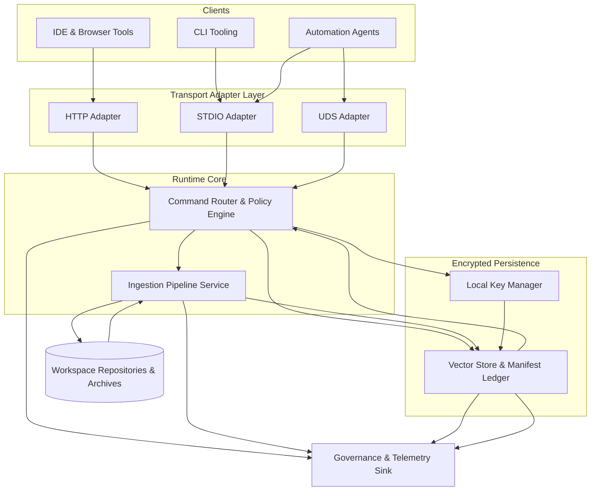

# Level 2 — Container View

The container view decomposes the Cursor Local Embedding MCP into deployable runtime units and persistent stores that collaborate inside a single workstation boundary. It aligns with the architecture overview and clarifies how loopback transports, ingestion services, encryption, and audit controls interact when the runtime is installed on Linux, macOS, or WSL.

## Runtime Containers and Responsibilities
| Container | Description | Key Responsibilities | Supporting Specs |
| --- | --- | --- | --- |
| HTTP Adapter | Loopback REST endpoint for IDE and browser tooling | Bind HTTPS listener, terminate TLS, enforce CSRF/session policies, normalize REST payloads into runtime commands | [Transport Adapter Specification](../../transport.md#http-adapter-lifecycle), [Configuration Matrix](../../transport.md#configuration-matrices) |
| STDIO Adapter | Stream-based interface for CLI tooling and scripting | Frame requests/responses, validate command envelopes, expose deterministic exit codes for automation | [Transport Adapter Specification](../../transport.md#stdio-adapter-lifecycle), [Configuration Matrix](../../transport.md#configuration-matrices) |
| UDS Adapter | High-throughput IPC endpoint for IDE extensions and WSL proxies | Authenticate via peer credentials, translate path semantics, support DPAPI-backed session tokens | [Transport Adapter Specification](../../transport.md#uds-adapter-lifecycle), [Configuration Matrix](../../transport.md#configuration-matrices) |
| Command Router & Policy Engine | Core runtime orchestrator invoked by all adapters | Authorize commands, route ingestion/search actions, collect telemetry, emit audit events | [Architecture Overview](../../overview.md#finalized-architecture-overview), [Transport Adapter Specification](../../transport.md) |
| Ingestion Pipeline Service | Deterministic workspace processor executing chunking and embedding | Enumerate repositories, expand archives, sanitize payloads, generate embeddings, produce manifest diffs | [Ingestion Pipeline Specification](../../ingestion.md) |
| Vector Store & Manifest Ledger | Encrypted persistence for embeddings and manifests | Seal embeddings with per-repo keys, maintain ledger hash chain, expose deterministic query API | [Vector Store Specification](../../vector-store.md), [Encryption Engine Specification](../../encryption.md) |
| Local Key Manager | Interface to OS credential stores | Issue, rotate, and revoke per-repo keys; enforce key access auditing | [Encryption Engine Specification](../../encryption.md#key-management-overview) |
| Governance & Telemetry Sink | Structured audit log store plus governance log integration | Persist request/response metadata, ingestion summaries, and review evidence for compliance | [Architecture Traceability Index](../../traceability.md#traceability-map), [Documentation Review Workflow](../../../process/doc-review.md) |

## Container Interactions

The container responsibilities mirror the diagrams in `docs/design/overview.md`: transports normalize requests into the command router, the ingestion pipeline and encrypted store run within the same local runtime, and governance sinks collect evidence for compliance.

## Operational Considerations and Rationale
- **Single-host deployment** keeps attack surfaces local and satisfies offline-first requirements. Containers communicate via in-process channels and shared memory, with optional background workers for ingestion and manifest replay.
- **Transport isolation** allows per-adapter rate limiting and credential policies without coupling to ingestion throughput. Each adapter logs into the governance sink and references the [PR Release Checklist](../../../process/pr-release-checklist.md#1-planning-approval) item requiring C4 confirmation.
- **Deterministic ingestion** ensures repository state changes produce predictable manifest diffs, aligning with the traceability commitments enumerated in the [Architecture Traceability Index](../../traceability.md#traceability-map).
- **Encrypted persistence** leverages OS key services, enforcing the controls described in the encryption design and mapping to the security checklists cited across subsystem specifications.
- **Governance logging** satisfies documentation review expectations by capturing when diagrams and narratives change, and linking those updates to the governance log per [doc-review.md](../../../process/doc-review.md).
- **Configuration discipline** requires runtime deployments to honor the transport matrices (loopback bindings, allowed principals, token secrets, retry budgets) so the documented security posture remains enforceable across environments.

## Documentation Review Sign-Off
Per the [Documentation Review Workflow](../../../process/doc-review.md) and [PR Release Checklist](../../../process/pr-release-checklist.md#1-planning-approval), record approvals when this document changes.

| Role | Reviewer | Date | Notes |
| --- | --- | --- | --- |
| Documentation Review Lead | _Pending — complete during review_ | _Pending_ |  |
| Security Reviewer | _Pending — complete during review_ | _Pending_ |  |
| Integration Owner | _Pending — complete during review_ | _Pending_ |  |

## Cross-Level Navigation
- ← [Level 1 — System Context](../level-1-context/README.md)
- → [Level 3 — Components](../level-3-components/README.md)
