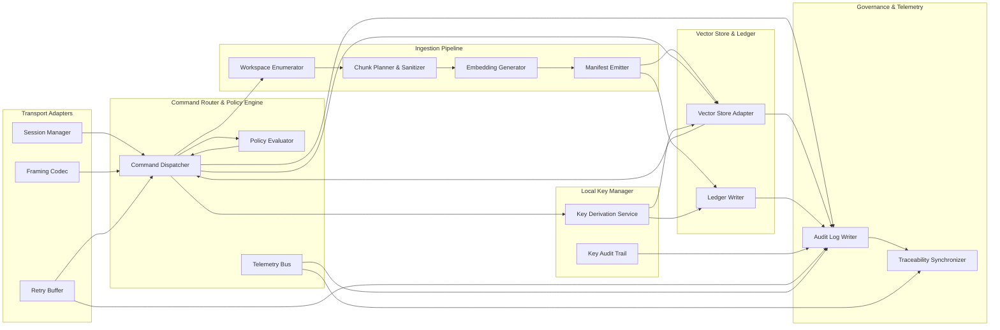

# Level 3 — Component View

The component view breaks each runtime container into collaborating modules. It shows how transport adapters normalize requests, how the command router coordinates ingestion and search flows, and how persistence, key management, and governance modules reinforce security and traceability requirements.

## Component Breakdown by Container
| Container | Component | Responsibilities | Supporting Specs |
| --- | --- | --- | --- |
| Transport Adapters | Session Manager | Authenticate principals, issue scoped tokens, enforce rate limits, capture telemetry | [Transport Adapter Specification](../../transport.md#public-interfaces), [Security Checklists](../../../security/threat-model.md#authentication-checklist) |
| Transport Adapters | Framing Codec | Encode/decode STDIO frames, normalize HTTP/UDS payloads, verify checksums | [Transport Adapter Specification](../../transport.md#cross-cutting-concerns) |
| Transport Adapters | Retry Buffer | Persist offline envelopes, enforce backpressure, encrypt queued payloads | [Transport Adapter Specification](../../transport.md#offline-backpressure), [Architecture Overview](../../overview.md#transport-adapters) |
| Command Router & Policy Engine | Command Dispatcher | Validate command schema, invoke ingestion/search handlers, map errors | [Architecture Overview](../../overview.md#finalized-architecture-overview) |
| Command Router & Policy Engine | Policy Evaluator | Apply authorization rules, consult capability matrix, enforce governance approvals | [Architecture Traceability Index](../../traceability.md#traceability-map), [PR Release Checklist](../../../process/pr-release-checklist.md#1-planning-approval) |
| Command Router & Policy Engine | Telemetry Bus | Emit structured events to governance sink, feed metrics exporters | [Documentation Review Workflow](../../../process/doc-review.md) |
| Ingestion Pipeline Service | Workspace Enumerator | Resolve repositories, merge ignore stacks, queue archive expansions | [Ingestion Pipeline Specification](../../ingestion.md#module-responsibilities) |
| Ingestion Pipeline Service | Chunk Planner & Sanitizer | Build deterministic chunk plans, scrub secrets, validate scripts | [Ingestion Pipeline Specification](../../ingestion.md#data-models) |
| Ingestion Pipeline Service | Embedding Generator | Invoke embedding models, compress vectors, emit diagnostics | [Ingestion Pipeline Specification](../../ingestion.md#module-responsibilities) |
| Ingestion Pipeline Service | Manifest Emitter | Persist manifest diffs, update ledger entries, trigger replay hooks | [Ingestion Pipeline Specification](../../ingestion.md#sequencing) |
| Vector Store & Manifest Ledger | Vector Store Adapter | Abstract storage backend, apply encryption, index vectors for search | [Vector Store Specification](../../vector-store.md#storage-layout) |
| Vector Store & Manifest Ledger | Ledger Writer | Maintain hash chain, correlate manifests with audit log | [Vector Store Specification](../../vector-store.md#ledger-and-manifest-governance) |
| Local Key Manager | Key Derivation Service | Bind keys to repository IDs, rotate on policy updates, attest usage | [Encryption Engine Specification](../../encryption.md#key-management-overview) |
| Local Key Manager | Key Audit Trail | Record key issuance/revocation, integrate with governance sink | [Encryption Engine Specification](../../encryption.md#telemetry--audit) |
| Governance & Telemetry Sink | Audit Log Writer | Store request/response envelopes, ingestion summaries, replay evidence | [Architecture Traceability Index](../../traceability.md#traceability-map), [Documentation Review Workflow](../../../process/doc-review.md) |
| Governance & Telemetry Sink | Traceability Synchronizer | Link architecture updates to subsystem specs and test matrix entries | [Architecture Overview](../../overview.md#finalized-architecture-overview), [Traceability Index](../../traceability.md) |

## Component Interaction Diagram

The interaction flow captures the narrative from `docs/design/overview.md`: transports normalize client traffic, the command router enforces policy before invoking ingestion, embedding output is stored in the encrypted vector store, and governance sinks receive telemetry and traceability updates.

## Cross-Cutting Concerns and Rationale
- **Policy-first routing** ensures every command passes through the policy evaluator before touching ingestion or storage, satisfying traceability and checklist requirements.
- **Deterministic ingestion stages** provide modular checkpoints—enumeration, planning, sanitization, embedding, manifest emission—that map directly to failing tests and fixtures described in subsystem specifications.
- **Separation of key management** isolates sensitive key operations, supporting OS-specific integrations and enabling governance auditing when keys rotate or are revoked.
- **Telemetry synchronization** between the telemetry bus, audit writer, and traceability synchronizer ensures documentation updates remain discoverable and verifiable during governance reviews.

## Documentation Review Sign-Off
Per the [Documentation Review Workflow](../../../process/doc-review.md) and [PR Release Checklist](../../../process/pr-release-checklist.md#1-planning-approval), record approvals when this document changes.

| Role | Reviewer | Date | Notes |
| --- | --- | --- | --- |
| Documentation Review Lead | _Pending — complete during review_ | _Pending_ |  |
| Security Reviewer | _Pending — complete during review_ | _Pending_ |  |
| Integration Owner | _Pending — complete during review_ | _Pending_ |  |

## Cross-Level Navigation
- ← [Level 2 — Container View](../level-2-containers/README.md)
- → [Level 4 — Code](../level-4-code/README.md)
