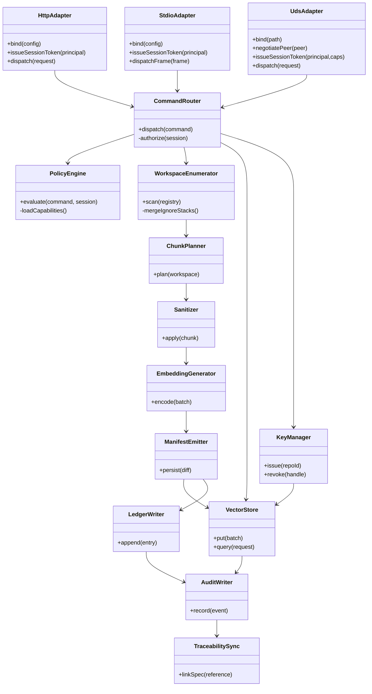

# Level 4 — Code View

The code view outlines the critical modules, data structures, and call paths that implement the components described at Level 3. It links architectural responsibilities to concrete namespaces, scripts, and fixtures so engineers can trace requirements into code and tests before implementation begins.

## Key Modules and Responsibilities
| Namespace / Module | Purpose | Key Types & Functions | Related Specs & Tests |
| --- | --- | --- | --- |
| `runtime::transport::http::Adapter` | Implements the HTTPS listener for IDE/browser clients | `HttpConfig`, `HttpAdapter::bind`, `HttpAdapter::issue_session_token`, `HttpAdapter::dispatch`, `TelemetrySink::record` | [Transport Adapter Specification](../../transport.md#http-adapter-lifecycle), [tests/runtime_transport/tests/adapters.rs](../../../tests/runtime_transport/tests/adapters.rs) |
| `runtime::transport::stdio::Adapter` | Frames CLI/stdin requests with deterministic envelopes | `StdioConfig`, `StdioAdapter::bind`, `FramingCodec::encode`, `StdioAdapter::dispatch_frame` | [Transport Adapter Specification](../../transport.md#stdio-adapter-lifecycle), [tests/runtime_transport/tests/adapters.rs](../../../tests/runtime_transport/tests/adapters.rs) |
| `runtime::transport::uds::Adapter` | Provides Unix domain socket bindings and WSL path translation | `UdsConfig`, `UdsAdapter::negotiate_peer`, `UdsAdapter::issue_session_token`, `UdsAdapter::dispatch` | [Transport Adapter Specification](../../transport.md#uds-adapter-lifecycle), [tests/runtime_transport/tests/adapters.rs](../../../tests/runtime_transport/tests/adapters.rs) |
| `runtime::router::CommandRouter` | Central dispatcher for normalized commands | `CommandRouter::dispatch`, `CommandRouter::authorize`, `CommandResponse` | [Architecture Overview](../../overview.md#finalized-architecture-overview), `scripts/offline_transport_buffer.py` |
| `runtime::router::PolicyEngine` | Evaluates capability matrices and governance flags | `PolicyEngine::evaluate`, `CapabilityGrant`, `AuditStamp` | [Architecture Traceability Index](../../traceability.md#traceability-map), [PR Release Checklist](../../../process/pr-release-checklist.md#1-planning-approval) |
| `ingestion::workspace::Enumerator` | Resolves workspace registries, merges ignore stacks | `WorkspaceEnumerator::scan`, `IgnoreStack` | [Ingestion Pipeline Specification](../../ingestion.md#module-responsibilities), `tests/fixtures/filesystem/` |
| `ingestion::planning::ChunkPlanner` | Produces deterministic chunk plans per repository | `ChunkPlanner::plan`, `ChunkPlan` | [Ingestion Pipeline Specification](../../ingestion.md#data-models), `tests/fixtures/archives/` |
| `ingestion::sanitization::Sanitizer` | Scrubs secrets, validates scripts, enforces quotas | `Sanitizer::apply`, `PolicyViolation` | [Ingestion Pipeline Specification](../../ingestion.md#cross-cutting-concerns), `scripts/sanitize_jsonl.py` |
| `ingestion::embedding::Generator` | Generates and compresses embeddings | `EmbeddingGenerator::encode`, `EmbeddingBatch` | [Ingestion Pipeline Specification](../../ingestion.md#module-responsibilities), `tests/golden/archives/quota-throughput.jsonl` |
| `ingestion::manifest::Emitter` | Emits manifest diffs and ledger updates | `ManifestEmitter::persist`, `ManifestDiff` | [Ingestion Pipeline Specification](../../ingestion.md#sequencing), `scripts/manifest_replay_harness.rs` |
| `storage::vector::Store` | Wraps encrypted persistence and vector indices | `VectorStore::put`, `VectorStore::query`, `EncryptionProfile` | [Vector Store Specification](../../vector-store.md#storage-layout), `tests/golden/security/encryption-toggle.trace` |
| `storage::ledger::Writer` | Maintains manifest hash chain and audit hooks | `LedgerWriter::append`, `LedgerEntry` | [Vector Store Specification](../../vector-store.md#ledger-and-manifest-governance), `scripts/trace_capture.sh` |
| `security::keys::Manager` | Mediates OS key services and rotation | `KeyManager::issue`, `KeyManager::revoke`, `KeyHandle` | [Encryption Engine Specification](../../encryption.md#key-management-overview), `scripts/collect_dpapi.ps1` |
| `governance::audit::Writer` | Captures request/response envelopes, telemetry, and replay evidence | `AuditWriter::record`, `TelemetryEvent` | [Architecture Traceability Index](../../traceability.md#traceability-map), `scripts/record_fs_events.py` |
| `governance::traceability::Sync` | Updates documentation pointers and governance logs | `TraceabilitySync::link_spec`, `TraceabilitySync::log_review` | [Documentation Review Workflow](../../../process/doc-review.md), [Traceability Index](../../traceability.md) |

## Code-Level Relationships

This diagram refines the Level 3 relationships with concrete class/module names, preserving the flow captured in `docs/design/overview.md` and the Level 3 component narrative.

## Implementation Guidance and Traceability
- **TDD expectations** — Each module above must be covered by failing tests before implementation, referencing fixtures in `tests/` and scripts documented in subsystem specs. Capture evidence in the PR release checklist when closing the red/green cycle.
- **Security hooks** — Modules interacting with credentials or storage must reference the relevant checklists in `docs/security/threat-model.md`, ensuring encryption, authentication, and sandboxing mitigations remain explicit.
- **Transport validation** — Keep the adapter crates synchronized with the integration coverage in `tests/runtime_transport/` so framing, authentication, and router error propagation remain observable across HTTP, STDIO, and UDS flows.
- **Governance integration** — `TraceabilitySync` is responsible for linking design updates back to subsystem specs and the [Architecture Traceability Index](../../traceability.md), satisfying governance log requirements.
- **Cross-platform concerns** — Transport adapters and key management modules must honor platform notes from the ingestion, transport, and vector-store specs to keep Linux/macOS/WSL behavior aligned.

## Documentation Review Sign-Off
Per the [Documentation Review Workflow](../../../process/doc-review.md) and [PR Release Checklist](../../../process/pr-release-checklist.md#1-planning-approval), record approvals when this document changes.

| Role | Reviewer | Date | Notes |
| --- | --- | --- | --- |
| Documentation Review Lead | _Pending — complete during review_ | _Pending_ |  |
| Security Reviewer | _Pending — complete during review_ | _Pending_ |  |
| Integration Owner | _Pending — complete during review_ | _Pending_ |  |

## Cross-Level Navigation
- ← [Level 3 — Component View](../level-3-components/README.md)
- ↑ [C4 Overview](../README.md)
