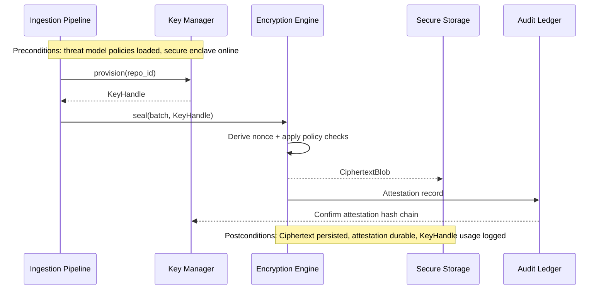

# Encryption Engine Specification

This document extends the encrypted storage flows in the [architecture overview](./overview.md), defining the dedicated encryption services that safeguard embeddings, manifests, and audit metadata.

## Module Responsibilities
- Manage key lifecycles, including creation, sealing, rotation, and revocation across repositories and workspaces.
- Provide streaming encryption/decryption primitives for ingestion writers and vector store readers.
- Maintain policy enforcement for cipher suite selection, nonce management, and integrity tagging.
- Expose attestation and compliance hooks for audit trails and external policy verification.
- Support cross-platform secure enclave integration (Linux, macOS Keychain, Windows DPAPI/WSL interop) with explicit downgrade procedures when certain facilities are unavailable offline.

## Public Interfaces

| Interface | Description | Inputs | Outputs |
|-----------|-------------|--------|---------|
| `KeyManager::provision(repo_id)` | Create or retrieve per-repository key material | Repository identifier, policy tag | `KeyHandle` |
| `KeyManager::rotate(schedule)` | Rotate keys according to policy | Rotation schedule, audit context | Rotation report |
| `EncryptionEngine::seal(batch, key_handle)` | Encrypt payloads with authenticated metadata | Plaintext payload, key handle, nonce strategy | Ciphertext blob + integrity tag |
| `EncryptionEngine::open(blob, key_handle)` | Decrypt and verify payloads | Ciphertext blob, key handle | Plaintext payload, verification report |
| `Attestor::stamp(event)` | Generate attestation artifacts for compliance | Event metadata, hash chain pointer | Signed attestation record |

---

### VectorStore Envelope & AAD (M3)

Milestone 3 introduces an AES‑GCM envelope for the Vector Store (`storage-vector`) guarded by the `encryption` feature flag:

- Envelope: magic `EVG1`, `key_id` (UTF‑8), 12‑byte nonce, reserved 16‑byte tag field, and ciphertext. Tag verification occurs within the AEAD during decryption.
- AAD: `"{repo_id}:{key_id}"` binds envelopes to repository scope and the issuing key; mismatched AAD rejects decryption.
- Keys: an in‑memory key manager supports basic rotation by updating `key_id`, while keeping prior keys available for reads. Tests derive a 32‑byte key from `SHA‑256(key_id)`; production deployments must use a proper KMS and key derivation.

See also: [Vector Store – Encrypted Envelope (M3)](./vector-store.md#encrypted-envelope-m3).

## Data Models
- **`KeyHandle`**: `{ key_id, repo_id, version, sealed_reference, expiry, policy }`.
- **`CiphertextBlob`**: `{ payload, nonce, tag, manifest_pointer, rotation_epoch }`.
- **`AttestationRecord`**: `{ event_id, timestamp, hash, policy_tag, verifier }`.
- **`RotationReport`**: `{ rotation_epoch, key_ids[], succeeded[], failed[], remediation_steps }`.
- **`VerificationReport`**: `{ blob_id, verified, failure_reason?, audit_pointer }`.

## Sequencing

## Preconditions & Postconditions
- **Preconditions**
  - Local secure enclave or keystore is initialized and unlockable for the session.
  - Threat-model driven policies (cipher suites, rotation cadence, attestation requirements) are loaded and validated.
  - Audit ledger is writable and hash-chain anchors are synchronized.
- **Postconditions**
  - Every encryption operation emits an attestation record chained to the audit ledger.
  - Key usage metrics update rotation schedules and revocation triggers.
  - Decryption failures surface actionable remediation paths without exposing key material.

## Cross-Cutting Concerns
- **Error Handling**: Differentiate between recoverable keystore timeouts and critical key compromise signals; escalate via incident hooks when compromise indicators surface.
- **Concurrency**: Serialize key rotations while allowing parallel seal/open operations through read-only handles with reference counting.
- **Resource Limits**: Monitor enclave session quotas, key cache sizes, and attestation storage growth to avoid exhausting offline workstations, including guidance for WSL users where host disk quotas apply.
- **Security Alignment**: Map all enforcement back to the [Encryption Checklist](../security/threat-model.md#encryption-checklist) and [Key Management Checklist](../security/threat-model.md#key-management-checklist); ensure policy exceptions are documented with compensating controls.
- **Offline Expectations**: Provide deterministic key caching and attestation batching for air-gapped sessions, replaying audit events once connectivity resumes.
- **Platform Notes**: Document per-platform key derivation, secure storage prerequisites, and fallback behavior when native enclaves are unavailable.

## Test hooks
Encryption services must introduce failing coverage aligned with the [Encryption & TLS Controls matrix entry](../testing/test-matrix.md#encryption--tls-controls) before implementation. Tie each hook to the [Encryption Checklist](../security/threat-model.md#encryption-checklist) and [Key Management Checklist](../security/threat-model.md#key-management-checklist) to maintain the audit chain:
- **Toggle negotiation hook** – Unit tests covering key negotiation toggles, rotation edge cases, and TLS validator behaviors using `tests/fixtures/security/encryption-latency.json` to ensure downgrade resistance and documented key lifecycle controls.
- **Encrypted persistence hook** – Integration tests replaying `tests/golden/security/encryption-toggle.trace` to validate rotation-aware unlock flows and confirm attestation records meet encryption checklist requirements.
- **Handshake fuzzing hook** – Fuzz coverage over `tests/golden/security/tls-negotiation.trace` and ciphertext blobs captured in `tests/golden/security/tls-performance.jsonl` to demonstrate tampering detection while recording the mitigations mandated by the key management checklist.
- **Rebuild performance hook** – Performance tests capturing encryption overhead during index rebuilds against `tests/golden/security/encryption-toggle.trace` outputs to confirm policy budgets and attestation batching remain within acceptable envelopes.
- Land each hook as a failing test ahead of implementation and reference `docs/process/pr-release-checklist.md` with the associated checklist mappings when presenting TDD evidence.
