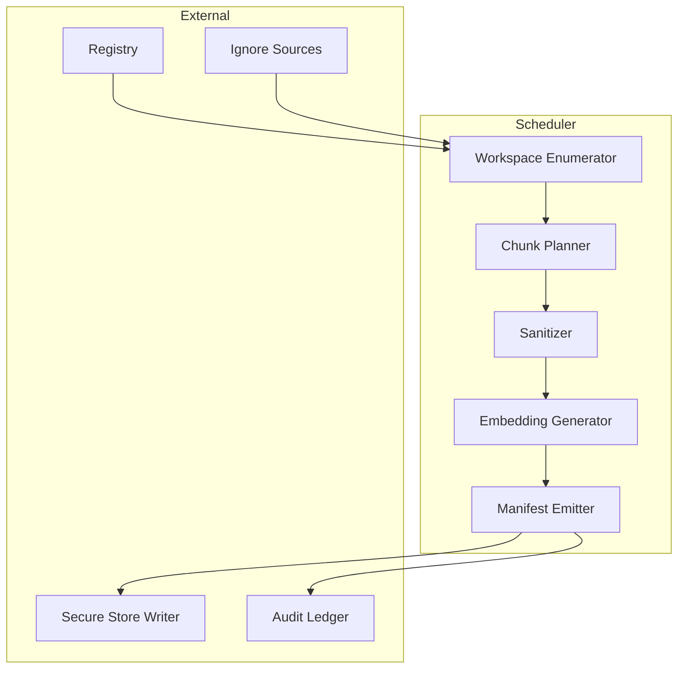

# Ingestion Pipeline Specification

This document elaborates on the ingestion pipeline highlighted in the [architecture overview](./overview.md), expanding the responsibilities, interfaces, and control flow for deterministic workspace indexing.

## Module Responsibilities
- Discover repositories and workspaces while respecting layered ignore rules and sandbox constraints.
- Chunk, sanitize, and transform source artifacts into embedding-ready payloads.
- Coordinate concurrent ingestion jobs with deterministic batching and retry semantics.
- Emit manifest updates and telemetry required by downstream encrypted storage writers and audit ledgers.

## Public Interfaces

| Interface | Description | Inputs | Outputs |
|-----------|-------------|--------|---------|
| `WorkspaceEnumerator::scan(registry)` | Resolve repositories scheduled for ingestion | Registry snapshot, ignore policies | Ordered list of `WorkspaceDescriptor` |
| `ChunkPlanner::plan(workspace)` | Create deterministic chunk batches per repository | Workspace descriptor | Iterable of `ChunkPlan` |
| `Sanitizer::apply(chunk)` | Scrub secrets, validate scripts, and enforce content rules | Raw chunk payload | Sanitized chunk payload + policy annotations |
| `EmbeddingGenerator::encode(batch)` | Produce vector embeddings for sanitized chunks | `ChunkPlan` batches | `EmbeddingBatch` with metadata |
| `PipelineOrchestrator::execute()` | Coordinate end-to-end ingestion and emit manifests | Scheduler context | Manifest diff, metrics, error reports |

## Data Models
- **`WorkspaceDescriptor`**: `{ repo_id, root_path, ignore_stack[], repo_type, manifest_cursor }`.
- **`ChunkPlan`**: `{ plan_id, repo_id, chunker_config, source_span, hash, retry_policy }`.
- **`SanitizedChunk`**: `{ plan_id, scrubbed_payload, redaction_log[], validation_status }`.
- **`EmbeddingBatch`**: `{ batch_id, repo_id, vectors[], encoder_id, compression_fingerprint }`.
- **`ManifestDiff`**: `{ repo_id, applied_at, added_chunks[], removed_chunks[], checksum }`.

## Sequencing

## Preconditions & Postconditions
- **Preconditions**
  - Repository registry is reachable with up-to-date metadata.
  - Ignore rules from git, IDE, and custom sources are successfully merged with no conflicts.
  - Embedding encoder assets are warmed and pass integrity validation.
- **Postconditions**
  - Every emitted `EmbeddingBatch` is accompanied by a manifest entry ready for encrypted persistence.
  - Sanitization audit trails are persisted for security review.
  - Failed chunks are retried or quarantined with explicit diagnostic artifacts.

## Cross-Cutting Concerns
- **Error Handling**: Recoverable errors trigger backoff-aware retries; irrecoverable sanitization failures quarantine artifacts and alert operators.
- **Concurrency**: Pipeline stages operate with bounded worker pools; chunk planning is parallelized per repository, while sanitization enforces per-repo serialization to avoid race conditions on policy caches.
- **Resource Limits**: Enforce memory budgets for chunk buffers and cap concurrent encoder jobs to maintain offline resource targets; streaming hashes limit temporary disk usage.
- **Security Alignment**: Sanitizer enforces script validation and secret scrubbing consistent with the [Sandboxing Checklist](../security/threat-model.md#sandboxing-checklist) and [Input Validation Checklist](../security/threat-model.md#input-validation-checklist).

## Required Failing Tests
Per the [test matrix](../testing/test-matrix.md#embedding-engine-core), author the following failing tests before implementation:
- Unit tests validating chunk planner boundary conditions and embedding dimensionality negotiation helpers.
- Integration tests executing end-to-end ingestion with deterministic batching and manifest emission.
- Fuzz tests supplying malformed document payloads across sanitizer and encoder surfaces.
- Performance tests verifying throughput for 10k document batches without exceeding resource budgets.
