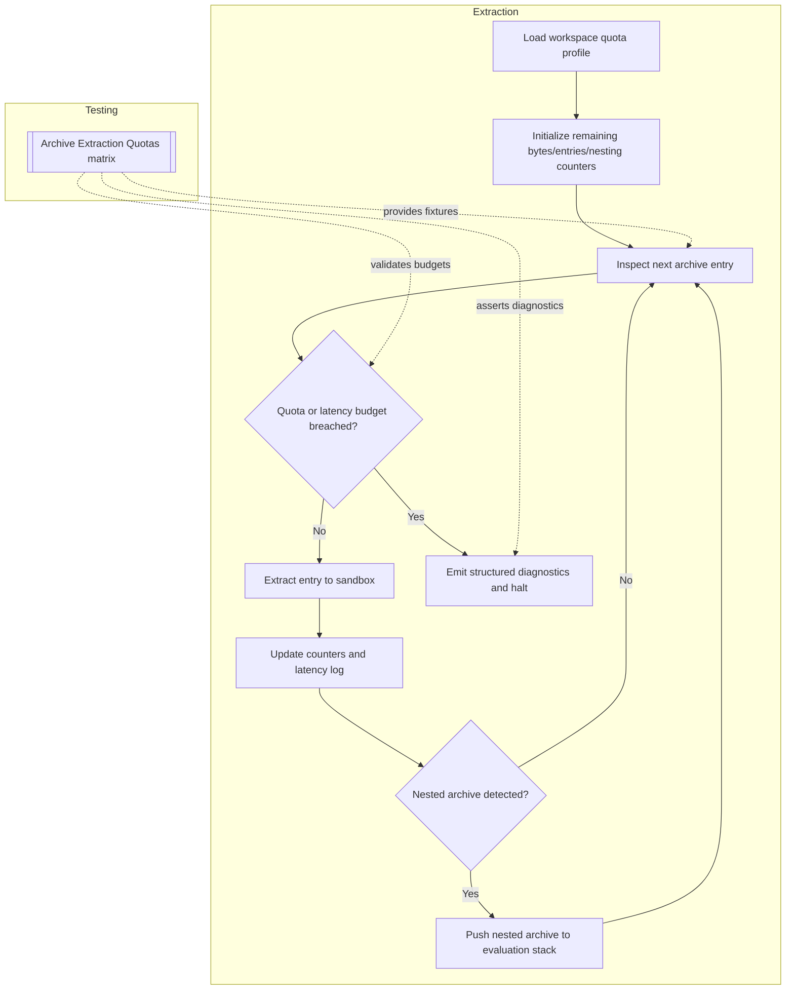

# Ingestion Pipeline Specification

This document elaborates on the ingestion pipeline highlighted in the [architecture overview](./overview.md), expanding the responsibilities, interfaces, and control flow for deterministic workspace indexing.

## Module Responsibilities
- Discover repositories and workspaces while respecting layered ignore rules and sandbox constraints.
- Expand supported archives (zip, tar, gzip) into ephemeral scratch space so ignore policies can be re-applied before ingestion.
- Chunk, sanitize, and transform source artifacts into embedding-ready payloads.
- Coordinate concurrent ingestion jobs with deterministic batching and retry semantics.
- Emit manifest updates and telemetry required by downstream encrypted storage writers and audit ledgers.

## Implementation Plan (2024-05)

1. **Red-Green Harness** – Extend the `crates/ingestion-*` crates with failing
   tests sourced from `tests/fixtures/filesystem/latency-window.yaml`,
   `tests/fixtures/archives/*.toml`, the delayed-ledger harness, and the
   manifest replay golden. The initial red stage will assert watcher latency
   propagation, archive quota exhaustion, replay diagnostics, and ledger delay
   handling before any production code lands.
2. **Module Implementations** – Replace the existing stubs with concrete
   implementations for `WorkspaceEnumerator`, `ChunkPlanner`, `Sanitizer`,
   `EmbeddingGenerator`, and `ManifestEmitter` per the interfaces in this
   document. Focus areas include deterministic ignore-stack merging, chunk plan
   hashing, sanitization redaction logs, encoder coordination, and encrypted
   manifest emission.
3. **Offline & Quota Plumbing** – Introduce offline replay buffers and quota
   trackers that respect retention ceilings. Wire the new data structures into
  `storage-ledger` and `storage-vector` so delayed-ledger fixtures replay
   deterministically, and so archive quota diagnostics surface in the planner
   tests.
4. **Documentation & Fixture Upkeep** – Refresh subsystem READMEs and the
   fixture plan with regeneration steps for any new captures, noting the related
   security checklist mappings that reviewers must verify.

This plan is executed before modifying the source modules and will be updated if
review uncovers new constraints or sequencing requirements.

## Public Interfaces

| Interface | Description | Inputs | Outputs |
|-----------|-------------|--------|---------|
| `WorkspaceEnumerator::scan(registry)` | Resolve repositories scheduled for ingestion | Registry snapshot, ignore policies, archive manifests | Ordered list of `WorkspaceDescriptor` |
| `ChunkPlanner::plan(workspace)` | Create deterministic chunk batches per repository | Workspace descriptor | Iterable of `ChunkPlan` |
| `Sanitizer::apply(chunk)` | Scrub secrets, validate scripts, and enforce content rules | Raw chunk payload | Sanitized chunk payload + policy annotations |
| `EmbeddingGenerator::encode(batch)` | Produce vector embeddings for sanitized chunks | `ChunkPlan` batches | `EmbeddingBatch` with metadata |
| `PipelineOrchestrator::execute()` | Coordinate end-to-end ingestion and emit manifests | Scheduler context | Manifest diff, metrics, error reports |

## Data Models
- **`WorkspaceDescriptor`**: `{ repo_id, root_path, ignore_stack[], repo_type, manifest_cursor, archives[] }`.
- **`ChunkPlan`**: `{ plan_id, repo_id, chunker_config, source_span, hash, retry_policy }`.
- **`SanitizedChunk`**: `{ plan_id, scrubbed_payload, redaction_log[], validation_status }`.
- **`EmbeddingBatch`**: `{ batch_id, repo_id, vectors[], encoder_id, compression_fingerprint }`.
- **`ManifestDiff`**: `{ repo_id, applied_at, added_chunks[], removed_chunks[], checksum }`.

## Sequencing

```mermaid
flowchart TD
    subgraph Scheduler
        A[Workspace Enumerator]
        B[Chunk Planner]
        C[Sanitizer]
        D[Embedding Generator]
        E[Manifest Emitter]
    end
    subgraph External
        R[Registry]
        I[Ignore Sources]
        S[Secure Store Writer]
        L[Audit Ledger]
    end

    R --> A
    I --> A
    A --> B
    B --> C
    C --> D
    D --> E
    E --> S
    E --> L
```

## Preconditions & Postconditions
- **Preconditions**
  - Repository registry is reachable with up-to-date metadata.
  - Ignore rules from git, IDE, and custom sources are successfully merged with no conflicts.
  - Embedding encoder assets are warmed and pass integrity validation.
- **Postconditions**
  - Every emitted `EmbeddingBatch` is accompanied by a manifest entry ready for encrypted persistence.
  - Sanitization audit trails are persisted for security review.
  - Failed chunks are retried or quarantined with explicit diagnostic artifacts.

## Cross-Cutting Concerns
- **Error Handling**: Recoverable errors trigger backoff-aware retries; irrecoverable sanitization failures quarantine artifacts and alert operators.
- **Concurrency**: Pipeline stages operate with bounded worker pools; chunk planning is parallelized per repository, while sanitization enforces per-repo serialization to avoid race conditions on policy caches.
- **Resource Limits**: Enforce memory budgets for chunk buffers and cap concurrent encoder jobs to maintain offline resource targets; streaming hashes limit temporary disk usage, including archive expansion buffers.
- **Security Alignment**: Sanitizer enforces script validation and secret scrubbing consistent with the [Sandboxing Checklist](../security/threat-model.md#sandboxing-checklist) and [Input Validation Checklist](../security/threat-model.md#input-validation-checklist), while archive extractors honor the [File Handling Checklist](../security/threat-model.md#file-handling-checklist) for temporary directories.
- **Platform Notes**: Document how case sensitivity, path length, and newline normalization differ across Linux, macOS, and WSL so deterministic chunking works across host environments.
- **Offline Expectations**: The pipeline must queue manifest emissions and audit updates when storage or ledger sinks are temporarily unavailable, replaying them once the offline constraint clears.

### Offline Replay Hooks

When storage endpoints are unreachable, the orchestrator persists manifest diffs and ledger updates in a local retry buffer. To keep this backlog safe and replayable:

- Persist manifests using the same encryption profile as live ledger writes and index them by monotonic sequence numbers to prevent reordering attacks during replay.
- Enforce bounded retention windows (`replay.max_age_ms`) and size ceilings validated by the [Offline Resilience & Replay matrix](../testing/test-matrix.md#offline-resilience--replay).
- Drain the backlog through the `manifest_replay_harness` described in the [Offline Queue & Replay Harnesses plan](../testing/fixtures-plan.md#offline-queue--replay-harnesses), ensuring the delayed-ledger fixtures remain authoritative for TDD.
- Emit replay telemetry to the audit ledger once connectivity is restored, capturing before/after checksums so the [Encryption Checklist](../security/threat-model.md#encryption-checklist) and [Sandboxing Checklist](../security/threat-model.md#sandboxing-checklist) requirements are satisfied.

All implementation work must begin with failing manifest replay integration and performance tests sourced from the fixtures above, proving that ingestion can recover deterministically after prolonged storage outages without losing audit fidelity.

## Archive Extraction Quota Enforcement
- **Quota Computation**: Archive extraction is constrained by a per-workspace byte ceiling (`quota.bytes_max`), file entry count ceiling (`quota.entries_max`), and a nested archive depth ceiling (`quota.nesting_max`). Each ceiling is calculated from the workspace profile selected by the scheduler and recorded alongside the registry manifest. Profiles apply deterministic multipliers for known large repositories and shrinkage factors for sandboxed clients. Before extraction begins, the orchestrator computes a cumulative budget (`quota.remaining_*`) and seeds the extractor with those counters so checks can be performed without round-trips.
- **Latency Budgets**: Archive handlers must complete quota evaluation, extraction, and sanitation within a rolling `latency_budget_ms` window. Budgets are enforced via a monotonic timer: `start_time` is captured prior to the first entry inspection, interim checkpoints log elapsed milliseconds per stage, and exhaustion of the budget triggers a `QuotaLatencyExceeded` error that includes both elapsed time and residual quota state. The latency window is sized according to the [Archive Extraction Quotas tests](../testing/test-matrix.md#archive-extraction-quotas) to ensure deterministic behavior during regression runs.
- **Exhaustion Handling**: When any quota counter reaches zero or the latency budget is exhausted, the extractor halts further entry reads, emits a structured diagnostic bundle, and tags the workspace as `ingestion.quota_exhausted`. The pipeline records the partial manifest, schedules a retry with exponential backoff, and attaches the bundle to the audit ledger. Exhaustion events additionally reference the [Sandboxing Checklist](../security/threat-model.md#sandboxing-checklist) to confirm that no temporary directories remain mounted, and the [Input Validation Checklist](../security/threat-model.md#input-validation-checklist) to ensure no unverified payloads leaked past the quarantine boundary.

### Quota Evaluation Flow

### Edge Case Handling & Security Alignment
- **Nested Archives**: Each detected archive within an archive increments the `nesting_depth` counter. Extraction continues only if the resulting depth is below `quota.nesting_max`; otherwise the entry is skipped, logged, and tied to the [Sandboxing Checklist](../security/threat-model.md#sandboxing-checklist) requirement that sandbox mounts are ephemeral and bounded. Nested archives that pass the limit are evaluated recursively with inherited quotas to prevent resource amplification.
- **Partial Failures**: If extraction of an entry fails due to corruption or policy violations, the extractor marks the entry as quarantined, decrements the retry counter, and records the failure reason in the manifest. Subsequent entries resume evaluation while ensuring no unvalidated content escapes the sandbox, satisfying the [Input Validation Checklist](../security/threat-model.md#input-validation-checklist). When repeated partial failures risk consuming the latency budget, the extractor also evaluates against the [File Handling Checklist](../security/threat-model.md#file-handling-checklist) to guarantee temporary files are cleaned and handles are closed.
- **Quota Drift Corrections**: When retries occur after partial failures, quota counters are reconciled against the diagnostic bundle to prevent drift (e.g., entries counted twice). Drift resolution references the [File Handling Checklist](../security/threat-model.md#file-handling-checklist) requirement that manifest updates reflect the precise set of files actually written to scratch space.

## Test hooks
The ingestion pipeline must land failing coverage from both the [Filesystem Watch Service matrix](../testing/test-matrix.md#filesystem-watch-service) and the [Archive Extraction Quotas matrix](../testing/test-matrix.md#archive-extraction-quotas) before implementation proceeds. Each hook must document the [Input Validation](../security/threat-model.md#input-validation-checklist) and [Sandboxing](../security/threat-model.md#sandboxing-checklist) checklist items it satisfies:
- **Watcher latency propagation hook** – Unit, integration, and fuzz tests sourced from `tests/fixtures/filesystem/latency-window.yaml`, `tests/fixtures/filesystem/workspace-replay/`, and `tests/golden/filesystem/watch-latency-burst.log` to prove debounce heuristics and queue propagation honor latency budgets without accepting malformed events.
- **Archive quota enforcement hook** – Unit and integration tests replaying `tests/fixtures/archives/quota-latency.toml` and `tests/fixtures/archives/overflow-latency.tar.zst` to guarantee byte ceilings, MIME filters, and latency logging behave deterministically across retries.
- **Quota resilience performance hook** – Performance coverage executing `tests/fixtures/archives/bulk-sample/` while verifying `tests/golden/archives/quota-throughput.jsonl` outputs stay within 2% enforcement overhead and preserve sandbox isolation guarantees for extraction tooling.
- **Chunk planner hygiene hook** – Fuzz and performance tests from the [Embedding Engine Core matrix](../testing/test-matrix.md#embedding-engine-core) ensuring malformed payloads are rejected and large batch workloads remain within resource ceilings, reinforcing both sandbox and validation controls.
- Record each hook as a failing test per the TDD workflow and reference `docs/process/pr-release-checklist.md` when capturing the associated security checklist evidence.
