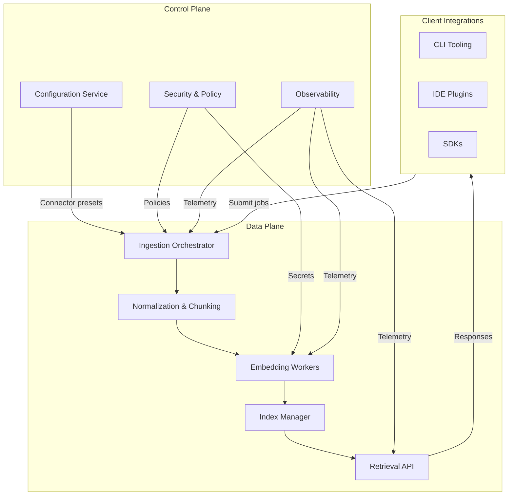
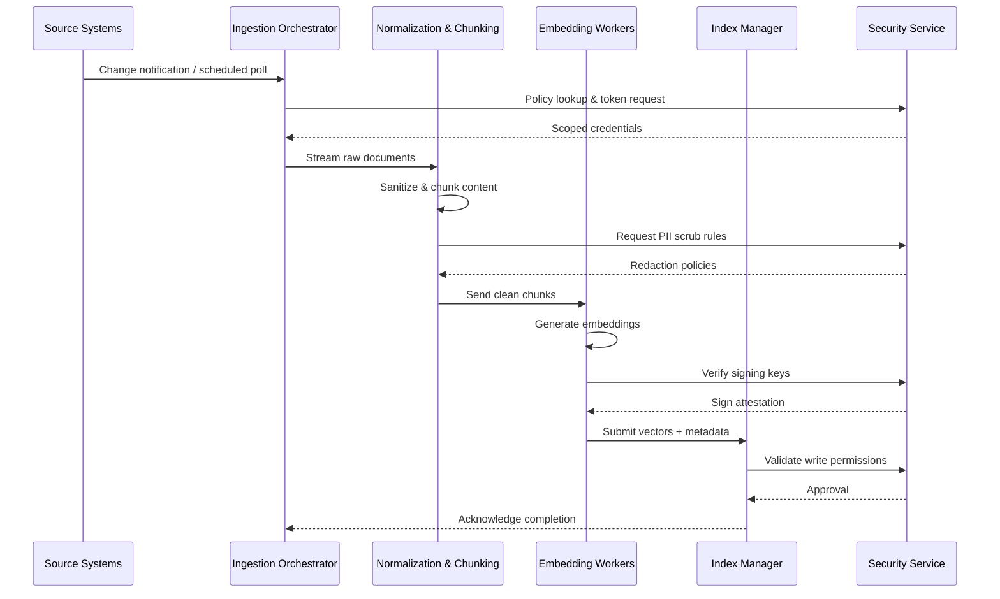
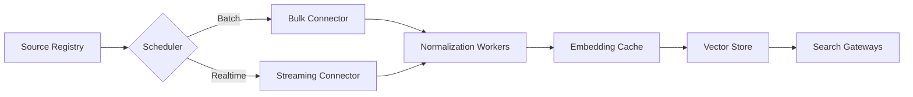
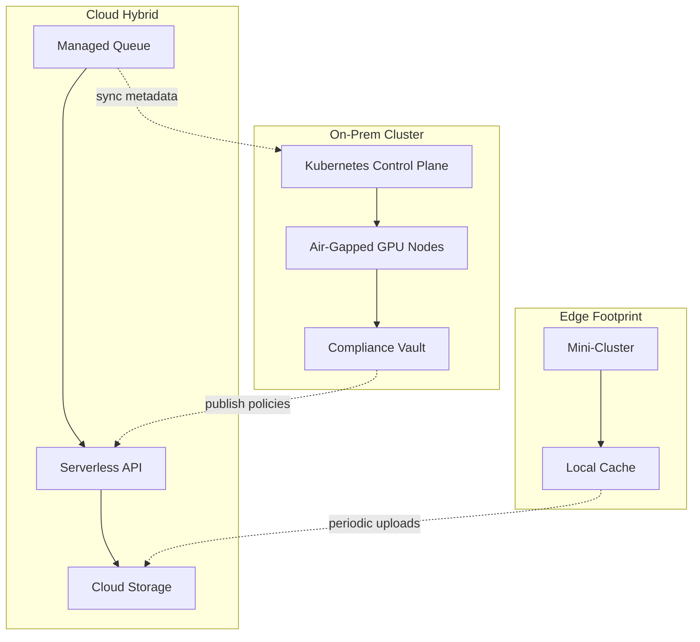

# Context

## Mission Objectives
- Deliver a local-first embedding management platform that accelerates retrieval augmented workflows without relying on external network connectivity.
- Provide consistent ingestion across codebases, documents, and structured data via modular connectors with transparent configuration.
- Maintain verifiable governance over embeddings, metadata, and audit logs to satisfy enterprise compliance requirements.

## System Landscape
The platform centers on a multi-service architecture that orchestrates content ingestion, embedding generation, indexing, and client-serving APIs. Each module exposes a bounded context to simplify testing, scaling, and replacement when algorithmic or infrastructure upgrades are required.

## Module Responsibilities
- **Configuration Service:** stores connector definitions, schedules, and transformation policies. Publishes updates to the orchestration queue and enforces version history.
- **Security & Policy:** handles key management, access control, PII scrubbing rules, and compliance evidence generation.
- **Ingestion Orchestrator:** coordinates source discovery, rate limiting, and back-pressure. Applies retries with exponential backoff and surfaces failures to observability tooling.
- **Normalization & Chunking:** performs content parsing, cleaning, and chunk sizing. Includes language detection, Markdown-to-text conversion, and diff-aware code extraction.
- **Embedding Workers:** execute model inference, manage GPU/accelerator pools, and cache intermediate results when permissible.
- **Index Manager:** persists vectors, metadata, and manifests across storage backends (local disk, SQLite, or enterprise vector stores) while supporting delta updates.
- **Retrieval API:** exposes query interfaces, handles hybrid search, and enforces response quotas per client.
- **Observability:** unifies metrics, tracing, and log pipelines with multi-tenant dashboards.

## Data Flow & Security Posture
- Data ingestion begins with connector registration, followed by scheduled or on-demand runs that feed the orchestrator queue.
- Content normalization removes secrets, identifies PII, and signs artifacts before embedding generation.
- Embedding workers authenticate via short-lived tokens stored in secure enclaves. Model artifacts are integrity-checked on load.
- Index writes require dual control: changes must pass validation by the security service before persistence.
- Retrieval requests are evaluated against role-based policies, and responses redact sensitive metadata unless the requester has explicit approval.

# Challenges
- Harmonizing connectors that operate across heterogeneous source formats (repositories, object storage, SaaS APIs) while maintaining deterministic behavior.
- Balancing offline-first requirements with the need for timely synchronization when connectivity is restored.
- Enforcing rigorous security controls without degrading ingestion throughput or query latency.
- Managing cost of hardware accelerators for embedding generation under bursty workloads.

# Choices
## Architectural Approaches
- Adopt an event-driven workflow using a durable queue to decouple ingestion, processing, and serving. This enables targeted scaling of embedding workers without impacting client SLAs.
- Implement pluggable storage drivers so deployments can select between local SQLite, PostgreSQL, or managed vector databases.
- Maintain strict separation between control plane policy enforcement and data plane execution to simplify audits.

## Ingestion Pipeline Strategy

- Schedulers choose between batch and streaming connectors based on SLA requirements.
- Normalization workers fan out across CPU pools and forward chunks to embedding cache layers that deduplicate repeated content.
- Vector store updates emit events to search gateways, enabling near-real-time refresh for client applications.

## Deployment Topologies

- On-prem deployments prioritize air-gapped security and integrate with hardware security modules for key custody.
- Hybrid deployments leverage managed queues and APIs while retaining sensitive data in private subnets.
- Edge installations optimize for intermittent connectivity with deferred synchronization to the cloud or central data centers.

## Security Controls & Compliance
- Zero-trust authentication with mutual TLS across services, certificate rotation automated via the security service.
- Secrets stored in encrypted vaults; services retrieve them using short-lived session tokens bound to workload identity.
- Continuous monitoring for data exfiltration through anomaly detection on retrieval API usage.
- Comprehensive audit trails capturing connector configuration changes, embedding generation lineage, and index mutations.

# Conclusions
- Proceed with implementing the event-driven ingestion backbone and pluggable storage drivers while finalizing GPU scheduling strategies.
- Validate the security posture through threat modeling workshops and penetration testing prior to GA launch.
- Prepare runbooks for each deployment topology, emphasizing backup/restore procedures and compliance evidence capture.
- Circulate this document to the architecture guild, security team, and platform operations group for review and sign-off ahead of the next planning increment.

