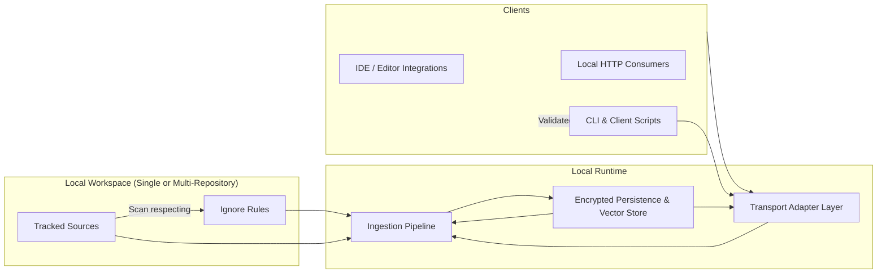
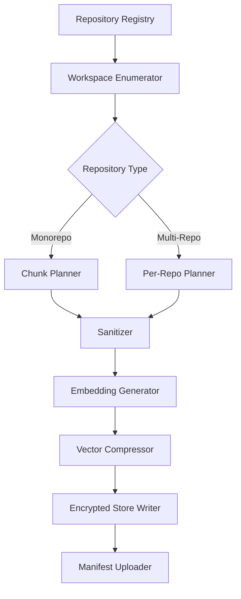
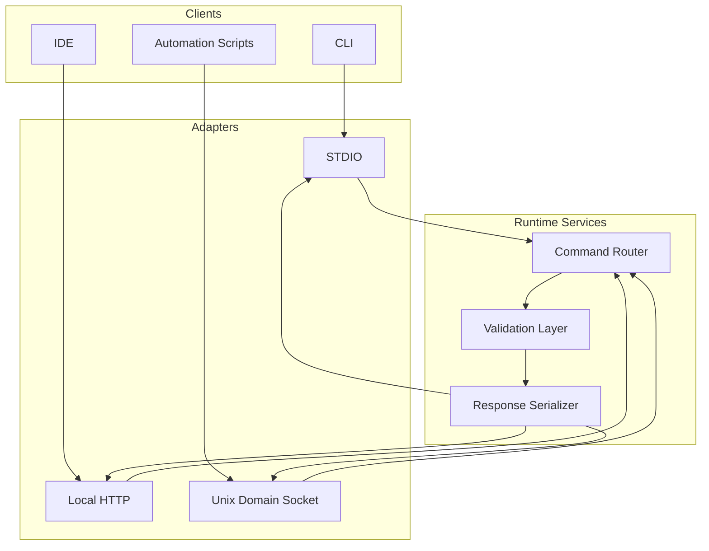
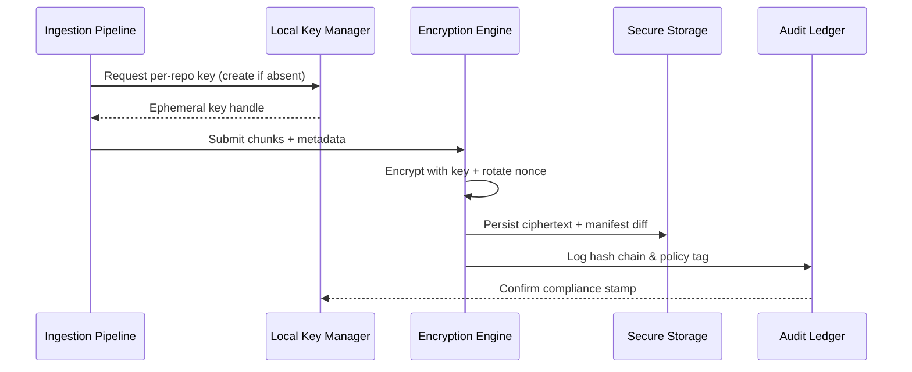

# Context

## Mission Objectives
- Deliver a local-first embedding management platform that accelerates retrieval-augmented workflows without requiring persistent external connectivity.
- Provide consistent ingestion across codebases, documents, and structured data via modular connectors with transparent configuration.
- Maintain verifiable governance over embeddings, metadata, and audit logs to satisfy enterprise compliance requirements while honoring the 4C documentation standard.

## Finalized Architecture Overview
The finalized architecture prioritizes local execution, secure persistence, and resilient developer ergonomics across Linux, macOS, and Windows Subsystem for Linux (WSL). Local transports (HTTP, stdio, and Unix domain sockets) let clients pick the most reliable mechanism per environment while keeping data resident on the workstation. Workspace indexing honors ignore rules (gitignore, editorconfig, custom patterns) to avoid private or transient files, handles common archive formats (zip, tar, gzip) through deterministic, read-only expansion, and encrypted persistence preserves confidentiality when multiple repositories share the same runtime.

> **C4 Source of Truth:** Detailed architecture narratives and level-specific diagrams for the Context, Containers, Components, and Code views live in [`docs/design/c4/`](./c4/README.md). Update those assets together with the Mermaid diagrams in this overview to keep textual and visual documentation synchronized.

### C4 Navigation
- [Level 1 — Context](./c4/level-1-context/README.md)
- [Level 2 — Containers](./c4/level-2-containers/README.md)
- [Level 3 — Components](./c4/level-3-components/README.md)
- [Level 4 — Code](./c4/level-4-code/README.md)

## Local Ingestion Pipeline
The ingestion pipeline is optimized for deterministic local indexing while supporting concurrent repositories.

- The workspace enumerator applies git, editor, and user-defined ignore rules before any data leaves disk buffers and expands supported archives in ephemeral scratch space so ignore rules can be re-applied to extracted contents.
- Sanitization performs secret scrubbing and client-script validation, ensuring unsigned scripts cannot run ingestion hooks.
- The encrypted store writer seals each batch with per-repository keys so multi-repository deployments remain logically isolated.

## Transport Adapters
Clients can reach the runtime through dedicated adapters that enforce authentication, input validation, and consistent auditing.

- HTTP adapters expose RESTful endpoints with loopback-only binding and CSRF defenses for local browser-based tooling.
- STDIO adapters power CLI workflows and provide deterministic framing for client-script validation.
- Unix domain sockets (UDS) deliver high-throughput, low-latency communication for IDE extensions and WSL interop, with file-system permissions restricting access and Windows path translation guards for cross-boundary operations.

## Encrypted Storage Flow
Encrypted persistence ensures all embeddings and manifests remain confidential even when multiple repositories share a runtime cache or when workspaces reside on removable media.

- Keys are sealed with OS-native secure enclaves or encrypted keystores; WSL deployments integrate with Windows DPAPI via interop shims that tolerate host sleep/restore cycles.
- The audit ledger records manifest hashes, rotation cadence, and validation results so security reviewers can trace every embedding write.
- Restore flows must validate ledger continuity before decrypting data, preventing tampering or rollback attacks.

## Security Priorities and Validation
- Enforce client-script validation before execution, rejecting untrusted or unsigned scripts and logging violations for forensic review while mapping enforcement steps to the [Sandboxing Checklist](../security/threat-model.md#sandboxing-checklist) and [Input Validation Checklist](../security/threat-model.md#input-validation-checklist).
- Maintain zero-trust defaults: transports require explicit session authorization and role-bound capabilities; HTTP session issuance references the [Authentication Checklist](../security/threat-model.md#authentication-checklist) and role modeling adheres to the [Access Control Checklist](../security/threat-model.md#access-control-checklist) so each adapter documents the control surface.
- Run continuous integrity checks on the encrypted store and manifest ledger; failed checks quarantine affected repositories and must be reconciled against the [Encryption Checklist](../security/threat-model.md#encryption-checklist).
- Document threat modeling outcomes alongside implementation changes, referencing `docs/security/threat-model.md` for each release and capturing links to completed checklists in PR templates.

## Platform Support and Operational Guidance
- Official support covers Linux, macOS, and Windows via WSL, ensuring consistent tooling and filesystem semantics. The transport adapters abstract path handling so WSL clients can reach host-mounted repositories securely, and design decisions must explicitly call out deviations for native Windows builds.
- Multi-repository workspaces share a common manifest registry that tracks repository lineage, branch context, and last-seen commit hash for reproducible indexing.
- Workspace indexing honors hierarchical ignore files (`.gitignore`, `.mcpignore`, IDE-specific excludes) to keep temporary assets and secrets out of the encrypted store, and archive extraction respects these rules before persisting any payloads.
- Offline-first operation is mandatory: synchronization and backup jobs can run opportunistically, but the runtime never requires cloud connectivity for core ingestion, search, or validation flows; all transport adapters and storage jobs must surface degraded-mode behavior for long-lived offline sessions.

## Implementation Decisions
- Prefer deterministic batching across repositories to simplify incremental updates and reduce lock contention in the encrypted store; per-repository manifests enable reproducible replays for offline troubleshooting.
- Use streaming hashes (BLAKE3) during ingestion to power incremental validation without re-reading large repositories, even when archives are expanded in scratch space.
- Keep observability local by default—structured logs and metrics ship to file or socket endpoints that administrators can forward using their preferred tooling; WSL deployments document how to persist logs across the Linux/Windows boundary.

## Next Steps
- Execute the cross-platform distribution workflow captured in the [Runtime Packaging & Distribution Plan](../implementation/runtime-packaging-plan.md), ensuring transport adapters, runtime services, and validation policies ship together with GitHub Actions–generated fixtures and goldens.
- Land the WSL multi-repository regression coverage described in the updated [Test Matrix](../testing/test-matrix.md#wsl-multi-repository-regressions), keeping failing tests and automation hooked to the regeneration workflows that refresh fixtures and goldens in CI.
- Synchronize the client and CI integration guides with the transport security checklist updates documented in [`docs/integration/clients.md`](../integration/clients.md) and [`docs/testing/ci-coverage.md`](../testing/ci-coverage.md) so developers can adopt HTTP, stdio, and UDS transports with auditable security references.

