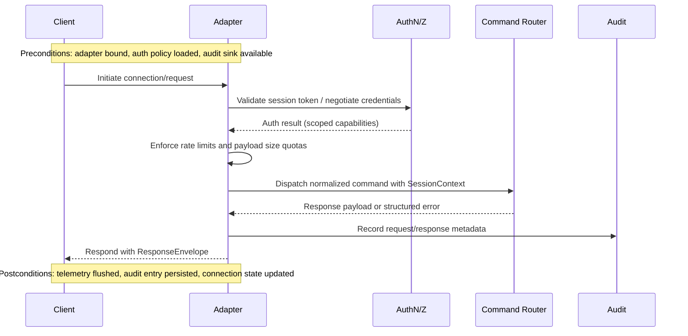

# Transport Adapter Specification

This module expands on the adapter responsibilities outlined in the [architecture overview](./overview.md), detailing how local clients bind to the runtime over HTTP, STDIO, and Unix domain socket transports.

## Module Responsibilities
- Provide authenticated, validated entry points for CLI, IDE, and automation clients.
- Normalize requests into the runtime command router contract while preserving per-transport telemetry.
- Enforce loopback-only exposure and enforceable session lifetimes to uphold offline-first guarantees.
- Guarantee cross-platform compatibility (Linux, macOS, WSL) by insulating path translation and credential-handshake quirks for HTTP, STDIO, and UDS adapters.
- Surface structured response envelopes with deterministic error codes so downstream automation remains resilient.

## Public Interfaces

| Interface | Description | Inputs | Outputs |
|-----------|-------------|--------|---------|
| `TransportAdapter::bind(config)` | Initialize a transport endpoint based on configuration | Transport configuration (port/path, auth policy, timeouts) | Running listener handle, lifecycle hooks |
| `TransportAdapter::dispatch(request)` | Validate, authenticate, and route a client request | Raw protocol payload | Normalized runtime command + context |
| `TransportAdapter::shutdown()` | Gracefully stop listeners and flush audit logs | Shutdown reason | Confirmation of teardown + persisted audit pointers |
| `SessionToken::issue(principal, scope)` | Issue scoped session tokens for HTTP/UDS clients | Principal identity, requested capabilities | Signed session token |
| `FramingCodec::encode/::decode` | Frame STDIO payloads with checksum + length headers | Raw bytes | Structured payload (request or response) |

## Data Models
- **`TransportConfig`**: YAML/JSON schema referencing adapter type, bind target, allowed principals, retry budget, and telemetry sinks.
- **`SessionContext`**: Captures principal, capabilities, CSRF nonce (HTTP), or peer credentials (UDS), and tracing identifiers.
- **`RequestEnvelope`**: `{ transport_id, session, payload, received_at, retry_count }` forwarded to the command router.
- **`ResponseEnvelope`**: `{ transport_id, status_code, payload, emitted_at, diagnostics[] }` delivered back to clients.

## Sequencing

## Preconditions & Postconditions
- **Preconditions**
  - Adapter listener is bound with loopback-only ACLs and validated configuration.
  - Authentication providers (token signer, peer credential verifier) are reachable.
  - Audit sink storage is writable and has sufficient quota.
- **Postconditions**
  - All accepted requests are logged with immutable identifiers and latency metrics.
  - Failed authentications produce structured error responses without leaking policy internals.
  - Session lifetimes are updated or revoked according to policy outcomes.

## Cross-Cutting Concerns
- **Error Handling**: Normalize transport-specific errors into `TransportError` codes; surface remediation hints and ensure retries respect idempotency.
- **Concurrency**: Use async executors per transport, isolating HTTP worker pools from STDIO single-flight handlers to prevent starvation.
- **Resource Limits**: Enforce per-transport connection caps, request body limits, and back-pressure thresholds aligning with the offline-first resource profile.
- **Security Alignment**: Enforce threat model mitigations by logging validation failures and mapping them to the [Input Validation Checklist](../security/threat-model.md#input-validation-checklist) and [Authentication Checklist](../security/threat-model.md#authentication-checklist); UDS peer credential checks must document assumptions about WSL interop sandboxes.
- **Offline Expectations**: All adapters must degrade gracefully when the host is offline, providing deterministic retries and telemetry buffering that satisfy the offline-first contract described in [overview.md](./overview.md).
- **Platform Notes**: Document how WSL path translation, Windows named pipe proxies, and macOS sandbox entitlements are handled so contributors can validate cross-platform behavior during implementation.

## Test hooks
Transport enablement depends on the failing coverage enumerated in the [Encryption & TLS Controls matrix entry](../testing/test-matrix.md#encryption--tls-controls). Establish these hooks before implementation and map their outcomes to the [Encryption Checklist](../security/threat-model.md#encryption-checklist) and [Input Validation Checklist](../security/threat-model.md#input-validation-checklist) for auditability:
- **TLS handshake negotiation hook** – Integration tests replaying `tests/golden/security/tls-negotiation.trace` to confirm deterministic cipher-suite downgrades are rejected across HTTP and UDS transports, capturing checklist evidence for both encryption enforcement and malformed payload handling.
- **Session token hardening hook** – Unit and fuzz coverage over session issuance, STDIO framing, and credential propagation using `tests/golden/security/tls-negotiation.trace` variants and `tests/golden/security/tls-performance.jsonl` jitter profiles to demonstrate signature validation and payload sanitization guardrails prior to router dispatch.
- **Toggle latency guard hook** – Performance tests exercising encryption-at-rest and TLS toggles with `tests/fixtures/security/encryption-latency.json` and `tests/golden/security/encryption-toggle.trace` under churn to measure connection setup latency against policy budgets while verifying log redaction requirements from the input validation checklist.
- Each hook must be introduced as a failing test in accordance with the TDD mandate and cross-referenced in `docs/process/pr-release-checklist.md` alongside the security checklist items they satisfy.
