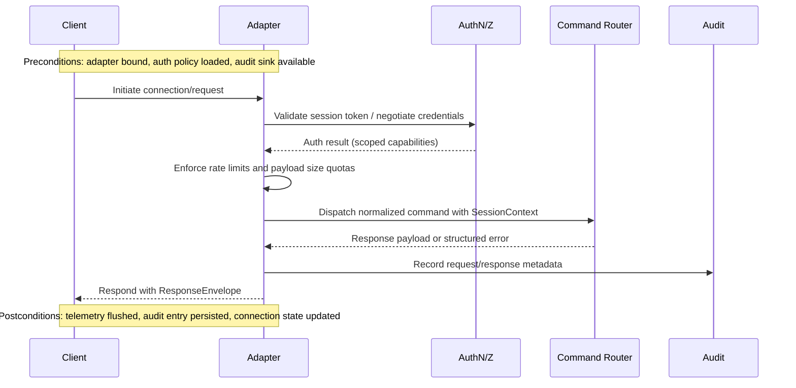
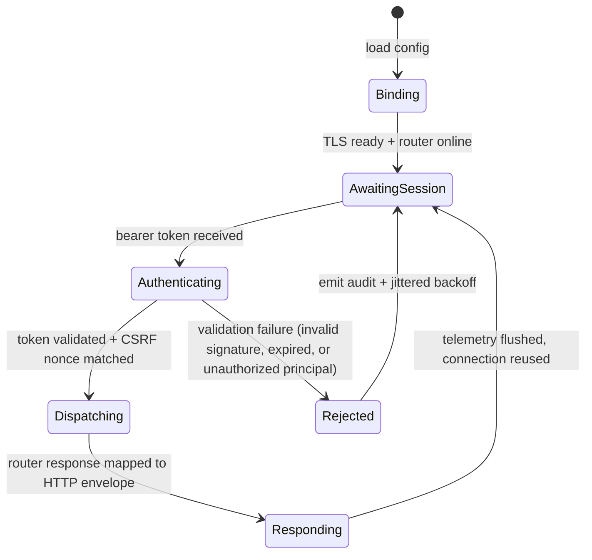
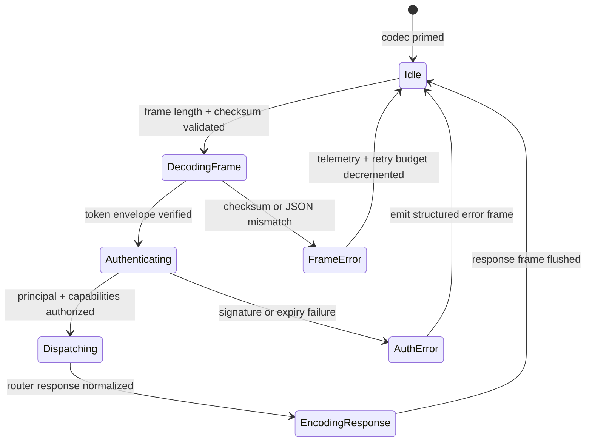
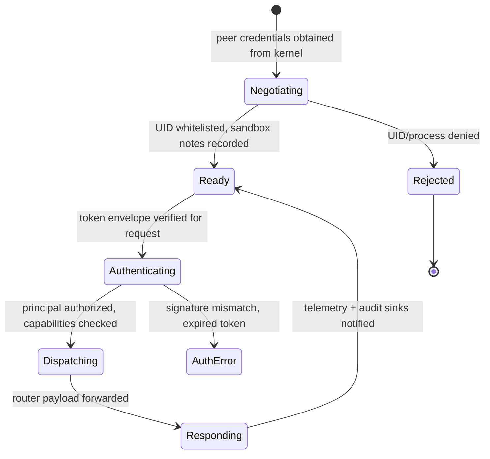

# Transport Adapter Specification

This module expands on the adapter responsibilities outlined in the [architecture overview](./overview.md), detailing how local clients bind to the runtime over HTTP, STDIO, and Unix domain socket transports.

## Module Responsibilities
- Provide authenticated, validated entry points for CLI, IDE, and automation clients.
- Normalize requests into the runtime command router contract while preserving per-transport telemetry.
- Enforce loopback-only exposure and enforceable session lifetimes to uphold offline-first guarantees.
- Guarantee cross-platform compatibility (Linux, macOS, WSL) by insulating path translation and credential-handshake quirks for HTTP, STDIO, and UDS adapters, including telemetry parity for WSL loopback proxies.
- Surface structured response envelopes with deterministic error codes so downstream automation remains resilient.

## Public Interfaces

| Interface | Description | Inputs | Outputs |
|-----------|-------------|--------|---------|
| `TransportAdapter::bind(config)` | Initialize a transport endpoint based on configuration | Transport configuration (port/path, auth policy, timeouts) | Running listener handle, lifecycle hooks |
| `TransportAdapter::dispatch(request)` | Validate, authenticate, and route a client request | Raw protocol payload | Normalized runtime command + context |
| `TransportAdapter::shutdown()` | Gracefully stop listeners and flush audit logs | Shutdown reason | Confirmation of teardown + persisted audit pointers |
| `SessionToken::issue(principal, scope)` | Issue scoped session tokens for HTTP/UDS clients | Principal identity, requested capabilities | Signed session token |
| `FramingCodec::encode/::decode` | Frame STDIO payloads with checksum + length headers | Raw bytes | Structured payload (request or response) |

## Data Models
- **`TransportConfig`**: YAML/JSON schema referencing adapter type, bind target, allowed principals, retry budget, and telemetry sinks.
- **`SessionContext`**: Captures principal, capabilities, CSRF nonce (HTTP), or peer credentials (UDS), and tracing identifiers.
- **`RequestEnvelope`**: `{ transport_id, session, payload, received_at, retry_count }` forwarded to the command router.
- **`ResponseEnvelope`**: `{ transport_id, status_code, payload, emitted_at, diagnostics[] }` delivered back to clients.

## Sequencing

## Adapter State Machines

### HTTP Adapter Lifecycle

### STDIO Adapter Lifecycle

### UDS Adapter Lifecycle

## Configuration Matrices

| Adapter | Loopback Binding | Authentication | Retry / Backpressure | Telemetry Destinations |
|---------|------------------|----------------|----------------------|------------------------|
| HTTP | `127.0.0.1:<port>` or `::1:<port>` with mandatory TLS when `tls_required=true` | BLAKE3-signed bearer tokens (`SessionToken`), CSRF nonce enforcement | Jittered exponential backoff on auth failures, request body capped at config-defined size | Structured events via `TelemetrySink` (`http.request`, `http.router.error`, `http.response`) |
| STDIO | `stdin/stdout` pipes, frame length bounded by `max_frame_length` | Signed envelopes validated per frame before router dispatch | Retry budget enforced through frame-level checksum errors, response frames mark `status` for automation | `TelemetrySink` emits `stdio.session.issued`, `stdio.request`, `stdio.response`, `stdio.router.error` |
| UDS | Absolute socket path under runtime data dir (`socket_path`) | Token envelope validated per request + peer UID gating via `allowed_uids` | Negotiation cache resets on rejection, unauthorized peers never reach router | `TelemetrySink` captures `uds.peer.accepted`, `uds.request`, `uds.response`, `uds.router.error` |

Each matrix entry maps directly to the configuration structs implemented in the adapter crates (`HttpConfig`, `StdioConfig`, and `UdsConfig`). Cross-check the `allowed_principals`, `token_secret`, and backpressure toggles in deployment manifests to ensure the documented defaults align with environment provisioning.

## Security Considerations

- **Token Signing & Expiry** – All adapters use keyed BLAKE3 signatures with per-token UUIDs. Validation paths feed into the [Authentication Checklist](../security/threat-model.md#authentication-checklist) and reference the integration tests under `tests/runtime_transport`. Expired or tampered tokens trigger structured `Unauthorized` responses and telemetry.
- **CSRF Enforcement (HTTP)** – CSRF nonces issued alongside session tokens are mandatory when `require_csrf=true`. The adapter refuses requests lacking the `X-Csrf-Token` header, satisfying the [Input Validation Checklist](../security/threat-model.md#input-validation-checklist).
- **Framing Integrity (STDIO)** – Frames include length prefixes and truncated BLAKE3 checksums before router dispatch. Invalid frames never reach the router and are logged against the [Sandboxing Checklist](../security/threat-model.md#sandboxing-checklist).
- **Peer Verification (UDS)** – Kernel-reported UIDs are checked against `allowed_uids` before command execution. Rejections are auditable and tied to the [Access Control Checklist](../security/threat-model.md#access-control-checklist).
- **Telemetry & Audit** – Every adapter surfaces lifecycle events via `TelemetrySink`, providing inputs for governance review and aligning with the PR checklist evidence requirements.

## Preconditions & Postconditions
- **Preconditions**
  - Adapter listener is bound with loopback-only ACLs and validated configuration.
  - Authentication providers (token signer, peer credential verifier) are reachable.
  - Audit sink storage is writable and has sufficient quota.
- **Postconditions**
  - All accepted requests are logged with immutable identifiers and latency metrics.
  - Failed authentications produce structured error responses without leaking policy internals.
  - Session lifetimes are updated or revoked according to policy outcomes.

## Cross-Cutting Concerns
- **Error Handling**: Normalize transport-specific errors into `TransportError` codes; surface remediation hints and ensure retries respect idempotency.
- **Concurrency**: Use async executors per transport, isolating HTTP worker pools from STDIO single-flight handlers to prevent starvation.
- **Resource Limits**: Enforce per-transport connection caps, request body limits, and back-pressure thresholds aligning with the offline-first resource profile.
- **Security Alignment**: Enforce threat model mitigations by logging validation failures and mapping them to the [Input Validation Checklist](../security/threat-model.md#input-validation-checklist), [Authentication Checklist](../security/threat-model.md#authentication-checklist), and [Access Control Checklist](../security/threat-model.md#access-control-checklist); UDS peer credential checks must document assumptions about WSL interop sandboxes.
- **Offline Expectations**: All adapters must degrade gracefully when the host is offline, providing deterministic retries and telemetry buffering that satisfy the offline-first contract described in [overview.md](./overview.md).
- **Platform Notes**: Document how WSL path translation, Windows named pipe proxies, and macOS sandbox entitlements are handled so contributors can validate cross-platform behavior during implementation.
- **WSL Telemetry Expectations**: Capture handshake metrics, DPAPI key-usage attestations, and loopback proxy latency under WSL by wiring transport logs into the telemetry sinks defined in `TransportConfig`; align the evidence with the failing coverage enumerated in the [Encryption & TLS Controls matrix](../testing/test-matrix.md#encryption--tls-controls).

### Offline Backpressure

Offline buffering introduces elevated security and resource risks because retry queues accumulate sensitive payloads on disk. The adapter must:

- Encrypt or seal buffered envelopes with the same policies used for live transport messages so air-gapped captures cannot leak plaintext commands.
- Enforce size and age ceilings (`retry_budget.max_items`, `retry_budget.max_age`) with deterministic eviction that is validated by the [Offline Resilience & Replay matrix](../testing/test-matrix.md#offline-resilience--replay).
- Emit audit breadcrumbs for enqueue/dequeue decisions without exposing user payloads, satisfying the [Access Control Checklist](../security/threat-model.md#access-control-checklist) requirement to trace privileged actions.
- Surface bounded backpressure telemetry so operators can drain queues before storage reconnect, aligning with the fixtures described in the [Offline Queue & Replay Harnesses](../testing/fixtures-plan.md#offline-queue--replay-harnesses).

Implementation must introduce failing coverage for these behaviors using the transport retry buffer integration and fuzz scenarios defined in the test matrix. The capture workflow in the fixtures plan produces deterministic queue snapshots for TDD, while the design-level guardrails ensure offline backlog growth cannot exhaust disk or leak encrypted payloads.

## Test hooks
Transport enablement depends on the failing coverage enumerated in the [Encryption & TLS Controls matrix entry](../testing/test-matrix.md#encryption--tls-controls). Establish these hooks before implementation and map their outcomes to the [Encryption Checklist](../security/threat-model.md#encryption-checklist) and [Input Validation Checklist](../security/threat-model.md#input-validation-checklist) for auditability:
- **TLS handshake negotiation hook** – Integration tests replaying `tests/golden/security/tls-negotiation.trace` to confirm deterministic cipher-suite downgrades are rejected across HTTP and UDS transports, capturing checklist evidence for both encryption enforcement and malformed payload handling.
- **Session token hardening hook** – Unit and fuzz coverage over session issuance, STDIO framing, and credential propagation using `tests/golden/security/tls-negotiation.trace` variants and `tests/golden/security/tls-performance.jsonl` jitter profiles to demonstrate signature validation and payload sanitization guardrails prior to router dispatch.
- **Toggle latency guard hook** – Performance tests exercising encryption-at-rest and TLS toggles with `tests/fixtures/security/encryption-latency.json` and `tests/golden/security/encryption-toggle.trace` under churn to measure connection setup latency against policy budgets while verifying log redaction requirements from the input validation checklist.
- **WSL loopback regression hook** – Integration tests replaying `tests/golden/transport/wsl-handshake-negotiation.trace` and asserting DPAPI key reuse via `tests/golden/security/dpapi-recovery-audit.jsonl` while capturing WSL-specific telemetry pipelines for the transport matrix entry.
- Each hook must be introduced as a failing test in accordance with the TDD mandate and cross-referenced in `docs/process/pr-release-checklist.md` alongside the security checklist items they satisfy.
