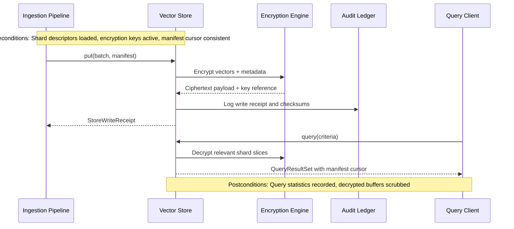

# Vector Store Specification

This specification complements the encrypted persistence path described in the [architecture overview](./overview.md) by detailing the logical vector store that persists and retrieves embeddings.

## Module Responsibilities
- Persist embedding batches in encrypted shards keyed by repository and workspace lineage.
- Expose retrieval primitives supporting similarity search, filtering, and manifest-backed pagination.
- Maintain compaction and rotation routines that respect resource budgets and preserve audit trails, including DPAPI-backed key recovery workflows for WSL-hosted shards.
- Provide transactional hooks for ingestion and transport layers to coordinate writes and reads.
- Surface cross-platform storage guidance so Linux, macOS, and WSL deployments maintain consistent file permissions, case handling, and path normalization.

## Public Interfaces

| Interface | Description | Inputs | Outputs |
|-----------|-------------|--------|---------|
| `VectorStore::put(batch, manifest)` | Persist an embedding batch into a shard | `EmbeddingBatch`, `ManifestDiff`, encryption context | `StoreWriteReceipt` |
| `VectorStore::query(criteria)` | Execute similarity search and filtering | Query criteria, tenant scope, consistency hints | `QueryResultSet` |
| `VectorStore::compact(policy)` | Run shard compaction and index optimization | Compaction policy, resource budget | `CompactionReport` |
| `VectorStore::rotate_keys(schedule)` | Trigger key rotation for shards | Rotation schedule, key handles | Updated shard descriptors |
| `VectorStore::export(manifest_cursor)` | Stream embeddings and metadata for backup | Manifest cursor, export policy | Stream of encrypted payloads |

## Data Models
- **`ShardDescriptor`**: `{ shard_id, repo_id, workspace_ids[], key_id, size_bytes, last_compacted_at }`.
- **`StoreWriteReceipt`**: `{ shard_id, batch_id, commit_ts, checksum, audit_pointer }`.
- **`QueryCriteria`**: `{ repo_scope, filters{}, vector, k, consistency_mode }`.
- **`QueryResultSet`**: `{ hits[], latency_ms, shard_scan_count, manifest_cursor }`.
- **`CompactionReport`**: `{ shard_id, reclaimed_bytes, segments_merged, warnings[] }`.

## Sequencing

## Preconditions & Postconditions
- **Preconditions**
  - Encryption engine exposes valid key handles for targeted shards.
  - Manifest cursors from ingestion align with the latest committed shard state.
  - Disk quotas and file descriptors are within configured budgets before writes or compactions begin.
- **Postconditions**
  - Every write produces a durable receipt referenced by the audit ledger.
  - Compaction operations emit reports and do not violate key rotation policies.
  - Query responses redact sensitive diagnostics while exposing necessary latency metrics.

## Cross-Cutting Concerns
- **Error Handling**: Differentiate between transient IO failures (retry) and shard corruption (quarantine + operator alert). Surface actionable diagnostics without exposing key material.
- **Concurrency**: Support concurrent readers and writers through optimistic MVCC, ensuring ingestion commits do not block read paths beyond configured contention windows.
- **Resource Limits**: Enforce shard size ceilings, compaction throttles, and buffer pool limits to maintain offline operation without exhausting local storage, documenting WSL-specific disk passthrough considerations.
- **Offline Expectations**: Buffer query analytics and rotation telemetry locally when disconnected from optional sync endpoints, replaying once connectivity is restored.
- **Platform Notes**: Specify how case sensitivity, filesystem notifications, and file-lock semantics differ across supported platforms so implementations remain portable.
- **WSL Telemetry Expectations**: Capture DPAPI key recovery events, shard unlock timings, and encryption envelope integrity when the store runs under WSL; align telemetry schemas with the failing coverage introduced in the [Encryption & TLS Controls matrix](../testing/test-matrix.md#encryption--tls-controls).
- **Security Alignment**: Integrate with encryption policies defined in [encryption.md](./encryption.md) and the [Encryption Checklist](../security/threat-model.md#encryption-checklist), and map query authorization flows to the [Access Control Checklist](../security/threat-model.md#access-control-checklist).

## Test hooks
Vector store hardening requires failing coverage from both the [Secure Storage & Retrieval matrix](../testing/test-matrix.md#secure-storage--retrieval) and the [Multi-Repository Routing matrix](../testing/test-matrix.md#multi-repository-routing). Capture their findings against the [Encryption Checklist](../security/threat-model.md#encryption-checklist) and [Sandboxing Checklist](../security/threat-model.md#sandboxing-checklist):
- **Shard integrity hook** – Unit and fuzz tests validating key rotation helpers, tamper detection, and receipt generation with `tests/fixtures/security/encryption-latency.json` and `tests/golden/security/encryption-toggle.trace` to demonstrate encryption guarantees and sandbox isolation of compromised shards.
- **Cross-repo routing hook** – Integration tests replaying `tests/golden/routing/multi-repo-latency.transcript` to confirm tenant isolation and routing-table merges remain within policy while enforcing encryption on every hop.
- **Routing throughput guard hook** – Performance coverage executing `tests/golden/routing/fanout-throughput.jsonl` alongside `tests/fixtures/routing/high-fanout/` to ensure scheduling latency stays within guardrails without violating sandbox-imposed resource ceilings.
- **Compaction resilience hook** – Performance and integration tests from the secure storage matrix verifying rotation-aware compaction against `tests/golden/security/encryption-toggle.trace` does not leak plaintext diagnostics and respects encryption attestations.
- **WSL DPAPI recovery hook** – Unit and integration tests targeting `tests/fixtures/security/dpapi-recovery/` with audit validation against `tests/golden/security/dpapi-recovery-audit.jsonl` to guarantee DPAPI-backed key handles are honored when shards migrate between Windows hosts and WSL distributions.
- Register each hook as a failing test ahead of implementation and cross-reference `docs/process/pr-release-checklist.md` with the corresponding security checklist evidence.

---

## Encrypted Envelope (M3)

The Vector Store uses an authenticated encryption envelope when the `encryption` feature is enabled. Milestone 3 implements an AES‑GCM envelope with a lightweight on‑wire format and AAD binding to repository context.

Envelope layout (bytes, little‑endian length field):

- Magic: `EVG1` (4 bytes)
- `key_id_len`: `u16` length of `key_id`
- `key_id`: UTF‑8 identifier for the active key (rotation friendly)
- `nonce`: 12‑byte random nonce (GCM recommended size)
- `tag`: 16‑byte GCM tag (detached, verified on open)
- `ciphertext`: AES‑GCM ciphertext

AAD (associated data):

- `aad = format!("{repo_id}:{key_id}")` binds envelopes to repository scope and the issuing key; decryption fails if AAD does not match.

Key handling (M3 scope):

- An in‑memory key manager exposes `current(scope)` and `get(key_id)` so older records remain readable after rotation. For tests, a deterministic 32‑byte key is derived via `SHA‑256(key_id)`; this is not a production derivation.
- Rotation is simulated by switching the `key_id` (e.g., from `k1` to `k2`); reads query the key manager by `key_id` embedded in the envelope.

Replay sequencing:

- `ReplayEntry.sequence` remains the ordering primitive. M3 does not alter replay semantics; checksum fields are placeholders used for deterministic tests. Future work will upgrade checksums to real digests and couple them with envelope metadata.

Security notes:

- Tamper detection leverages AES‑GCM authentication; any change to the envelope payload causes decryption to fail. Tests flip the last byte of the stored envelope to validate this behavior.
- The current tag field is reserved; the AEAD verifies tags internally from the ciphertext. A later revision may split and expose the tag explicitly in the envelope for tooling purposes.
