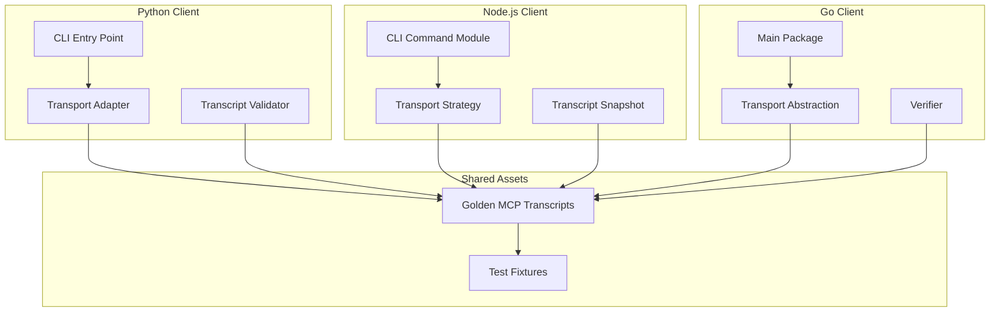

# MCP Client Implementation Plan

This plan elaborates how the Python, Node.js, and Go client scripts described in
[`docs/integration/clients.md`](./clients.md) will be implemented, tested, and
validated across transports and platforms.

## Architectural Overview

Each client script will:

1. Parse CLI arguments and resolve environment-specific defaults.
2. Instantiate a transport adapter (stdio, HTTP(S)/SSE, or TLS-wrapped channel).
3. Exchange JSON-RPC 2.0 envelopes with the MCP server.
4. Persist request/response transcripts for regression validation.
5. Emit deterministic exit codes for CI automation.

## Test-Driven Development Approach

The implementation for every language follows a red-green-refactor loop:

1. **Golden transcript fixtures** are authored first to capture the expected
   MCP dialogue for each transport. Initial tests will fail because the
   implementations are absent or incomplete.
2. **Unit and integration tests** are written per client to assert transcript
   parity, transport negotiation, and CLI ergonomics.
3. Implementations are completed only after failing tests exist, ensuring that
   behavior is driven by test expectations.
4. **Refactor** once tests pass, keeping fixtures synchronized and updating
   documentation as needed.

Golden transcripts live under `tests/fixtures/<language>/<transport>.json` to
support uniform assertions across languages.

## Validation Strategy

Validation combines automated tests, transcript comparison, and transport
exercising:

- **Transcript diffing**: Tests load the expected golden transcript and compare
  normalized JSON-RPC envelopes with live captures. Differences fail the test
  suite.
- **Transport matrix**: Each client must successfully execute `stdio`, `http`
  (SSE/WebSocket where applicable), and `tls` transports.
- **CLI contract checks**: Tests assert presence of required flags, default
  values, and helpful usage output.
- **Server mocking**: Lightweight mock MCP servers simulate responses so tests
  are deterministic without a full backend spin-up.

## Client-Specific Plans

### Python Client (`clients/python/client.py`)

- **Architecture**: A single `main()` orchestrates argument parsing (via
  `argparse`), dispatches to a `TransportFactory`, and streams envelopes through
  protocol-specific adapters. `TranscriptRecorder` captures traffic for
  validation.
- **TDD**: Use `pytest` with parametrized cases per transport. Initial tests
  instantiate the CLI in subprocess mode, asserting exit codes and transcript
  equality against fixtures.
- **Validation**:
  - **Stdio**: Spawn the MCP server as a subprocess using pipes.
  - **HTTP**: Exercise SSE over HTTP using `aiohttp` mocks.
  - **TLS**: Wrap HTTP transport with `ssl.create_default_context()` and verify
    certificate handling.
  - **Golden transcripts**:

    | Transport | Request Fixture | Response Fixture |
    |-----------|-----------------|------------------|
    | `stdio`   | `python/stdio/request.json`   | `python/stdio/response.json`   |
    | `http`    | `python/http/request.json`    | `python/http/response.json`    |
    | `tls`     | `python/tls/request.json`     | `python/tls/response.json`     |

### Node.js Client (`clients/node/index.mjs`)

- **Architecture**: An ES module exports a `runClient` function invoked by the
  CLI wrapper. Transport strategies are encapsulated in classes implementing a
  common `connect()` interface. A `Recorder` module writes transcripts to
  `./artifacts/node/`.
- **TDD**: Utilize `vitest` or `jest` with snapshot testing that consumes the
  golden transcripts. Tests run the CLI via `execa` to mimic user invocation.
- **Validation**:
  - **Stdio**: Use `child_process.spawn` to connect over stdio pipes.
  - **HTTP**: Leverage native `fetch` (Node 18+) to stream SSE events.
  - **TLS**: Configure `https.Agent` with custom CA support to verify
    certificate pinning.
  - **Golden transcripts**:

    | Transport | Request Fixture | Response Fixture |
    |-----------|-----------------|------------------|
    | `stdio`   | `node/stdio/request.json`   | `node/stdio/response.json`   |
    | `http`    | `node/http/request.json`    | `node/http/response.json`    |
    | `tls`     | `node/tls/request.json`     | `node/tls/response.json`     |

### Go Client (`clients/go/main.go`)

- **Architecture**: The `main` package defers to a `client` package providing a
  `Run(opts Options)` entry point. Interfaces `Transport` and `Recorder`
  decouple connection logic. JSON encoding uses `encoding/json` with
  deterministic key ordering.
- **TDD**: Apply `go test` with table-driven cases. Integration tests use
  `exec.Command` to run the binary and compare transcript files written to
  `./artifacts/go/`.
- **Validation**:
  - **Stdio**: Manage pipes with `cmd.StdinPipe`/`StdoutPipe` to interact with a
    mock server process.
  - **HTTP**: Employ `net/http` with SSE decoding helpers to process streaming
    responses.
  - **TLS**: Configure `tls.Config` to trust repository-provided CA bundles and
    assert on peer certificate fields.
  - **Golden transcripts**:

    | Transport | Request Fixture | Response Fixture |
    |-----------|-----------------|------------------|
    | `stdio`   | `go/stdio/request.json`   | `go/stdio/response.json`   |
    | `http`    | `go/http/request.json`    | `go/http/response.json`    |
    | `tls`     | `go/tls/request.json`     | `go/tls/response.json`     |

## Automated Verification via Golden Transcripts

For deterministic regression coverage:

- Each client writes its live transcript to `artifacts/<language>/<transport>.json`.
- Tests load the golden fixture and perform strict JSON equality using
  normalized ordering.
- On mismatch, tests emit a diff that includes method, params, and metadata to
  simplify debugging.
- Updating fixtures requires explicit approval via a `--update-transcripts`
  flag in the test runner to prevent accidental drift.

## Transport Exercising Matrix

| Transport | Python Execution | Node.js Execution | Go Execution |
|-----------|-----------------|------------------|---------------|
| `stdio`   | `python clients/python/client.py --transport stdio ...` | `node clients/node/index.mjs --transport stdio ...` | `go run clients/go/main.go --transport stdio ...` |
| `http`    | `python clients/python/client.py --transport http ...` | `node clients/node/index.mjs --transport http ...` | `go run clients/go/main.go --transport http ...` |
| `tls`     | `python clients/python/client.py --transport tls ...` | `node clients/node/index.mjs --transport tls ...` | `go run clients/go/main.go --transport tls ...` |

Each command is scripted within CI to guarantee consistent coverage across
language ecosystems.

## Cross-Platform Considerations

- **macOS**: Ensure the TLS tests honor the system keychain and avoid requiring
  GNU-specific utilities. Use universal shebangs (`/usr/bin/env`).
- **Windows**: Provide PowerShell-friendly invocation examples and avoid
  assuming POSIX path separators. For stdio transport, ensure CRLF handling is
  normalized. Use `python.exe`/`node.exe` detection when PATH resolution fails.
- **Linux**: Target glibc-compatible distributions with minimal dependencies.
  Containers in CI emulate this environment for deterministic builds.
- **WSL**: Document any path translation quirks (e.g., `/mnt/c`), and ensure TLS
  certificates are discoverable in both Windows and Linux stores.

Test suites should run within GitHub-hosted macOS, Windows, and Ubuntu runners
plus a WSL-specific job that installs the Windows MCP server binary and runs
clients from the Linux subsystem.

## Continuous Integration Integration

1. **Job Matrix**: Extend the pipeline with a `clients` workflow matrix over
   `{python, node, go} × {stdio, http, tls}` and `{ubuntu-latest, macos-latest,
   windows-latest}` runners. WSL coverage is achieved by an additional
   Windows-hosted job invoking the Linux clients inside WSL.
2. **Artifacts**: Each job uploads live transcripts for diff inspection. Failed
   runs attach diffs as build artifacts.
3. **Static Analysis**: Lint Python with `ruff`, Node.js with `eslint`, and Go
   with `golangci-lint` before executing integration tests.
4. **Security Checks**: Verify TLS fixtures and certificate expiration as part
   of the CI job to prevent stale credentials.
5. **Gating**: Merge requires all matrix jobs to pass. Nightly scheduled builds
   rerun the matrix to catch environment drift.

## Documentation Synchronization

Upon implementation, update `docs/integration/clients.md` with links to the
transcripts, mention CI coverage, and ensure transport instructions remain
consistent with the plan above.
