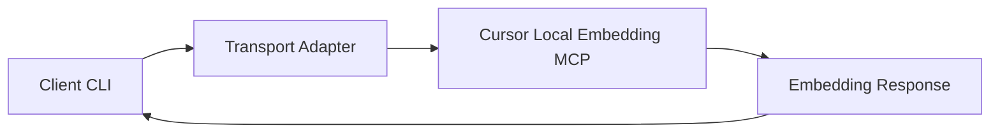
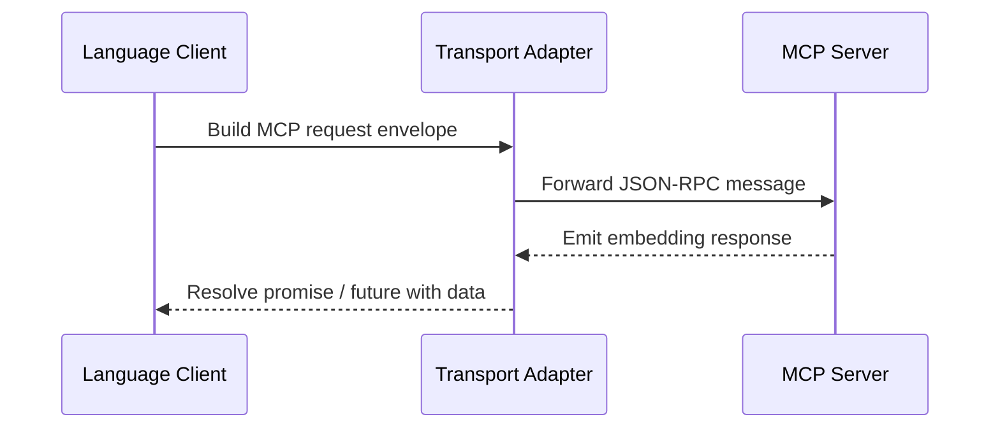

# Client Script Reference

The repository ships lightweight client scripts for exercising the Cursor Local Embedding MCP server from Python, Node.js, and Go environments. This document explains how to run each script, what command-line arguments are supported, and the MCP envelopes you should expect to exchange with the server.

## Common Options

All client scripts accept the following arguments:

- `--transport`: Desired MCP transport (`stdio`, `sse`, or `websocket`).
- `--prompt`: Natural-language text to embed.
- `--model`: Embedding model identifier (defaults to `text-embedding-3-large`).

Unless noted otherwise, commands are executed from the repository root.



## Python Client (`clients/python/client.py`)

### Run Command

```bash
python clients/python/client.py --transport stdio --prompt "Summarize integration steps" --model text-embedding-3-large
```

### Expected MCP Envelope

Request sent by the Python script:

```json
{
  "jsonrpc": "2.0",
  "id": "request-1",
  "method": "call_tool",
  "params": {
    "name": "create-embedding",
    "arguments": {
      "model": "text-embedding-3-large",
      "input": "Summarize integration steps"
    }
  }
}
```

Response returned by the MCP server:

```json
{
  "jsonrpc": "2.0",
  "id": "request-1",
  "result": {
    "content": [
      {
        "type": "embeddings",
        "embedding": [0.0123, -0.0044, 0.9987, "..."]
      }
    ],
    "timing": {
      "latencyMs": 123
    }
  }
}
```

## Node.js Client (`clients/node/index.mjs`)

### Run Command

```bash
node clients/node/index.mjs --transport websocket --prompt "List supported IDEs" --model text-embedding-3-large
```

### Expected MCP Envelope

Request emitted by the Node.js script:

```json
{
  "jsonrpc": "2.0",
  "id": 42,
  "method": "call_tool",
  "params": {
    "name": "create-embedding",
    "arguments": {
      "model": "text-embedding-3-large",
      "input": "List supported IDEs"
    }
  }
}
```

Typical response returned by the server:

```json
{
  "jsonrpc": "2.0",
  "id": 42,
  "result": {
    "content": [
      {
        "type": "embeddings",
        "embedding": [0.1021, 0.2234, -0.9981, "..."]
      }
    ],
    "diagnostics": []
  }
}
```

## Go Client (`clients/go/main.go`)

### Run Command

```bash
go run clients/go/main.go --transport sse --prompt "Explain transport selection" --model text-embedding-3-large
```

### Expected MCP Envelope

Request generated by the Go script:

```json
{
  "jsonrpc": "2.0",
  "id": "go-client-7",
  "method": "call_tool",
  "params": {
    "name": "create-embedding",
    "arguments": {
      "model": "text-embedding-3-large",
      "input": "Explain transport selection"
    }
  }
}
```

Expected response from the MCP server:

```json
{
  "jsonrpc": "2.0",
  "id": "go-client-7",
  "result": {
    "content": [
      {
        "type": "embeddings",
        "embedding": [-0.0456, 0.7812, 0.3345, "..."]
      }
    ],
    "meta": {
      "transport": "sse"
    }
  }
}
```

## Interaction Timeline


