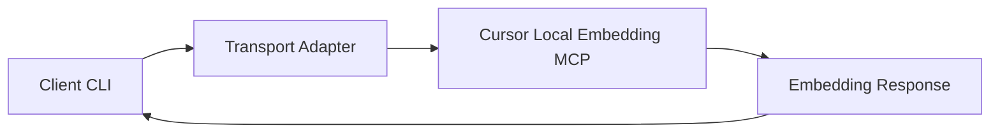
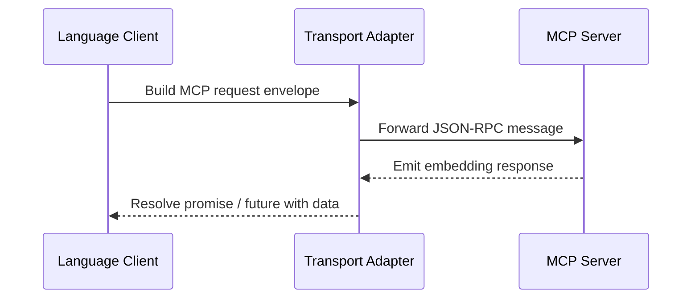

# Client Script Reference

> **Status:** The language-specific client scripts are under active development. Until
> the implementations land in `clients/python`, `clients/node`, and `clients/go`, use
> this document as a design preview and contributor guide rather than runnable
> instructions.

For the full implementation roadmap, transcript expectations, and CI test plan, see
[`docs/integration/client-plan.md`](./client-plan.md).

## Common Options (Planned)

All client scripts will accept the following arguments once the tooling is merged:

- `--transport`: Desired MCP transport (`stdio`, `sse`, or `websocket`).
- `--prompt`: Natural-language text to embed.
- `--model`: Embedding model identifier (defaults to `text-embedding-3-large`).

Unless noted otherwise, commands are executed from the repository root.



## Python Client (`clients/python/client.py` – planned)

### Planned Run Command

```bash
python clients/python/client.py --transport stdio --prompt "Summarize integration steps" --model text-embedding-3-large
```

### Expected MCP Envelope

Request sent by the Python script:

```json
{
  "jsonrpc": "2.0",
  "id": "request-1",
  "method": "call_tool",
  "params": {
    "name": "create-embedding",
    "arguments": {
      "model": "text-embedding-3-large",
      "input": "Summarize integration steps"
    }
  }
}
```

Response returned by the MCP server:

```json
{
  "jsonrpc": "2.0",
  "id": "request-1",
  "result": {
    "content": [
      {
        "type": "embeddings",
        "embedding": [0.0123, -0.0044, 0.9987, "..."]
      }
    ],
    "timing": {
      "latencyMs": 123
    }
  }
}
```

## Node.js Client (`clients/node/index.mjs` – planned)

### Planned Run Command

```bash
node clients/node/index.mjs --transport websocket --prompt "List supported IDEs" --model text-embedding-3-large
```

### Expected MCP Envelope

Request emitted by the Node.js script:

```json
{
  "jsonrpc": "2.0",
  "id": 42,
  "method": "call_tool",
  "params": {
    "name": "create-embedding",
    "arguments": {
      "model": "text-embedding-3-large",
      "input": "List supported IDEs"
    }
  }
}
```

Typical response returned by the server:

```json
{
  "jsonrpc": "2.0",
  "id": 42,
  "result": {
    "content": [
      {
        "type": "embeddings",
        "embedding": [0.1021, 0.2234, -0.9981, "..."]
      }
    ],
    "diagnostics": []
  }
}
```

## Go Client (`clients/go/main.go` – planned)

### Planned Run Command

```bash
go run clients/go/main.go --transport sse --prompt "Explain transport selection" --model text-embedding-3-large
```

### Expected MCP Envelope

Request generated by the Go script:

```json
{
  "jsonrpc": "2.0",
  "id": "go-client-7",
  "method": "call_tool",
  "params": {
    "name": "create-embedding",
    "arguments": {
      "model": "text-embedding-3-large",
      "input": "Explain transport selection"
    }
  }
}
```

Expected response from the MCP server:

```json
{
  "jsonrpc": "2.0",
  "id": "go-client-7",
  "result": {
    "content": [
      {
        "type": "embeddings",
        "embedding": [-0.0456, 0.7812, 0.3345, "..."]
      }
    ],
    "meta": {
      "transport": "sse"
    }
  }
}
```

## Golden Transcript Fixtures and CI Coverage

Contributors must author golden MCP transcript fixtures **before** wiring up the
client implementations. Tests will load the fixtures from
`tests/fixtures/<language>/<transport>.json` and diff them against live transcripts
captured during test runs. If transcripts are missing or drift from the golden copies,
the CI matrix will fail.

Continuous integration executes a `clients` workflow that fans out across the transport
matrix documented in [`docs/testing/ci-coverage.md`](../testing/ci-coverage.md). The
matrix covers `{python, node, go} × {stdio+noise, http+tls, wsl-bridge}` combinations on
GitHub-hosted macOS, Windows, Ubuntu, and WSL runners. Each job uploads the live
transcripts for inspection, enforces the transcript diff checks, and runs the
language-specific linters (`ruff`, `eslint`, and `golangci-lint`). Until the client code
lands, these jobs remain pending in the plan and will be enabled alongside the initial
implementation PRs.

Refer to the [client implementation plan](./client-plan.md) for detailed guidance on
fixture naming, transport adapters, and the TDD workflow that governs the roll-out.

## Interaction Timeline (Conceptual)


