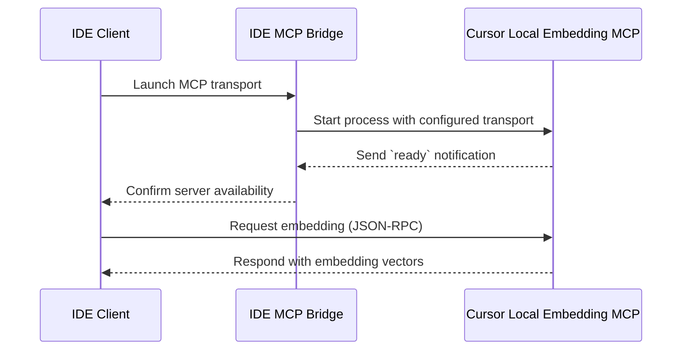

# IDE Integration Overview

This guide summarizes the supported IDE clients for the Cursor Local Embedding MCP server. Each section outlines minimum requirements, supported transport layers, and sample configuration snippets for connecting to the server.

## Cursor IDE

- **Requirements**
  - Cursor Desktop v0.45 or later with MCP plugin support enabled.
  - Node.js 18+ runtime available for spawning MCP transports.
  - Local access to the `cursor-local-embedding` executable on the PATH.
- **Supported transports**: `stdio`, `sse`, and `websocket` via Cursor's agent bridge.
- **Configuration snippet** (add to `~/.cursor/mcp.json`):

```json
{
  "servers": {
    "cursor-local-embedding": {
      "command": "cursor-local-embedding",
      "args": ["--transport", "stdio"],
      "readyTimeoutMs": 10000
    }
  }
}
```

## Windsurf

- **Requirements**
  - Windsurf v0.8+ with custom MCP endpoints enabled.
  - Python 3.11+ (required for the official Windsurf MCP bridge).
  - Firewall rules allowing local loopback connections on configurable ports.
- **Supported transports**: `websocket` and `sse` through the Windsurf bridge; `stdio` is unsupported.
- **Configuration snippet** (example `windsurf.mcp.yaml` entry):

```yaml
servers:
  cursor-local-embedding:
    transport: websocket
    command: cursor-local-embedding
    args:
      - "--transport"
      - "websocket"
      - "--port"
      - "8820"
```

## Visual Studio Code

- **Requirements**
  - VS Code 1.85+ with the MCP Client extension installed.
  - Go 1.21+ toolchain for building the extension's helper binaries.
  - Access to the `cursor-local-embedding` binary within the workspace.
- **Supported transports**: `stdio` (default) and `sse` via the extension configuration.
- **Configuration snippet** (example `.vscode/settings.json` fragment):

```json
{
  "mcp.servers": {
    "cursor-local-embedding": {
      "command": "cursor-local-embedding",
      "args": ["--transport", "stdio"],
      "env": {
        "CURSOR_EMBED_MODEL": "text-embedding-3-large"
      }
    }
  }
}
```

## Interaction Flow


