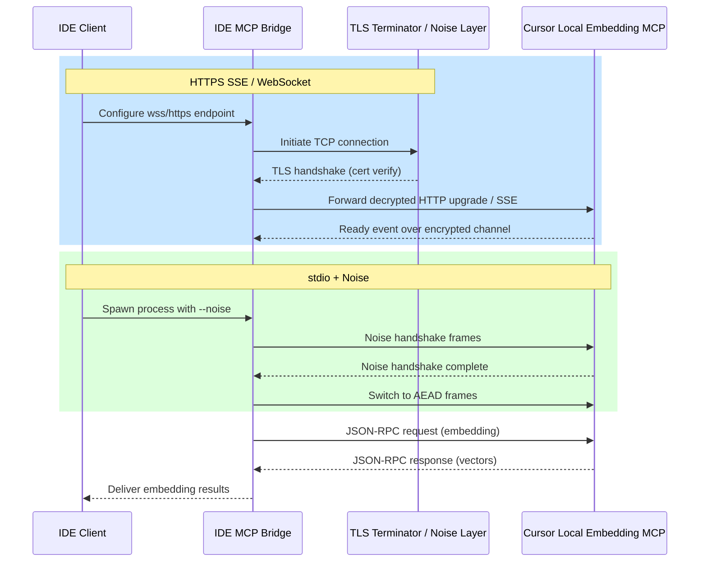

# IDE Integration Overview

This guide summarizes the supported IDE clients for the Cursor Local Embedding MCP server. Each section outlines minimum requirements, supported transport layers, and sample configuration snippets for connecting to the server. Configuration guidance intentionally mirrors the transport flags and JSON-RPC envelopes described in [`docs/integration/clients.md`](./clients.md), the CI coverage documented in [`docs/testing/ci-coverage.md`](../testing/ci-coverage.md), and the implementation milestones captured in [`docs/integration/client-plan.md`](./client-plan.md) so that IDE setup remains aligned with the official client tooling.

## Cursor IDE

- **Requirements**
  - Cursor Desktop v0.45 or later with MCP plugin support enabled.
  - Node.js 18+ runtime available for spawning MCP transports.
  - Local access to the `cursor-local-embedding` executable on the PATH.
- **Supported transports**: `stdio`, `sse`, and `websocket` via Cursor's agent bridge. These map one-to-one to the transport matrix in the planned client scripts (`clients/python/client.py`, `clients/node/index.mjs`, `clients/go/main.go`).
- **Configuration snippet** (add to `~/.cursor/mcp.json`):

```json
{
  "servers": {
    "cursor-local-embedding": {
      "command": "cursor-local-embedding",
      "args": ["--transport", "stdio"],
      "readyTimeoutMs": 10000
    }
  }
}
```

### Encrypted transport configuration

Enable Cursor's HTTPS-capable SSE bridge when you need to traverse corporate networks or enforce TLS pinning. Define the remote endpoint and provide trusted certificates explicitly:

```json
{
  "servers": {
    "cursor-local-embedding": {
      "transport": "sse",
      "url": "https://localhost:8843/mcp",
      "tls": {
        "caFile": "/etc/ssl/certs/cursor-rootCA.pem",
        "clientCert": "~/.cursor/tls/client.pem",
        "clientKey": "~/.cursor/tls/client-key.pem"
      }
    }
  }
}
```

### WSL launch bridge

When Cursor runs on Windows while the MCP server runs inside WSL, invoke the binary through `wsl.exe -e` so Windows delegates execution to the Linux environment. Pass the desired distribution name with `-d` (omit to use the default) and continue to map certificate paths to `/mnt` mounts:

```json
{
  "servers": {
    "cursor-local-embedding": {
      "command": "wsl.exe",
      "args": [
        "-d",
        "Ubuntu",
        "-e",
        "/usr/local/bin/cursor-local-embedding",
        "--transport",
        "stdio"
      ],
      "env": {
        "SSL_CERT_FILE": "/mnt/c/Users/<user>/cursor/tls/rootCA.pem"
      }
    }
  }
}
```

## Windsurf

- **Requirements**
  - Windsurf v0.8+ with custom MCP endpoints enabled.
  - Python 3.11+ (required for the official Windsurf MCP bridge).
  - Firewall rules allowing local loopback connections on configurable ports.
- **Supported transports**: `websocket` and `sse` through the Windsurf bridge; `stdio` is unsupported.
- **Configuration snippet** (example `windsurf.mcp.yaml` entry):

```yaml
servers:
  cursor-local-embedding:
    transport: websocket
    command: cursor-local-embedding
    args:
      - "--transport"
      - "websocket"
      - "--port"
      - "8820"
```

### Encrypted transport configuration

Leverage secure websockets by pointing Windsurf at a TLS-terminated listener. The `certChain` and `privateKey` paths should reference PEM files accessible to the Windsurf bridge process:

```yaml
servers:
  cursor-local-embedding:
    transport: websocket
    url: wss://127.0.0.1:8820/mcp
    tls:
      verify: true
      certChain: /etc/windsurf/tls/client-chain.pem
      privateKey: /etc/windsurf/tls/client-key.pem
      caFile: /etc/windsurf/tls/rootCA.pem
```

### WSL launch bridge

When Windsurf (Windows) tunnels into a WSL-hosted server, use `wsl.exe -e` to start the MCP server inside Linux and keep `/mnt` paths for TLS assets:

```yaml
servers:
  cursor-local-embedding:
    transport: websocket
    url: wss://127.0.0.1:8882/mcp
    command: wsl.exe
    args:
      - "-d"
      - "Ubuntu"
      - "-e"
      - "/usr/local/bin/cursor-local-embedding"
      - "--transport"
      - "websocket"
      - "--port"
      - "8882"
    env:
      SSL_CERT_FILE: /mnt/c/Users/<user>/windsurf/tls/rootCA.pem
```

## Visual Studio Code

- **Requirements**
  - VS Code 1.85+ with the MCP Client extension installed.
  - Go 1.21+ toolchain for building the extension's helper binaries.
  - Access to the `cursor-local-embedding` binary within the workspace.
- **Supported transports**: `stdio` (default) and `sse` via the extension configuration.
- **Configuration snippet** (example `.vscode/settings.json` fragment):

```json
{
  "mcp.servers": {
    "cursor-local-embedding": {
      "command": "cursor-local-embedding",
      "args": ["--transport", "stdio"],
      "env": {
        "CURSOR_EMBED_MODEL": "text-embedding-3-large"
      }
    }
  }
}
```

### Encrypted transport configuration

VS Code's MCP Client extension can connect over HTTPS SSE with explicit certificate pinning:

```json
{
  "mcp.servers": {
    "cursor-local-embedding": {
      "transport": "sse",
      "url": "https://localhost:8900/mcp",
      "tls": {
        "caCertificate": "${workspaceFolder}/certs/rootCA.pem",
        "clientCertificate": "${workspaceFolder}/certs/client.pem",
        "clientKey": "${workspaceFolder}/certs/client-key.pem"
      }
    }
  }
}
```

### WSL path convention

Inside a WSL workspace, prefer Linux-native paths while the VS Code UI runs on Windows. Use `${wslWorkspaceFolder}` to avoid hard-coding mount points:

```json
{
  "mcp.servers": {
    "cursor-local-embedding": {
      "command": "${wslWorkspaceFolder}/.venv/bin/cursor-local-embedding",
      "args": ["--transport", "stdio"],
      "env": {
        "SSL_CERT_FILE": "${wslWorkspaceFolder}/certs/rootCA.pem"
      }
    }
  }
}
```

## HTTP/TLS Configuration

All MCP transports other than raw `stdio` support TLS encryption to protect embeddings in transit. When enabling HTTPS-based SSE or secure websockets:

- Terminate TLS close to the MCP server to minimize unencrypted hops.
- Provide a certificate authority bundle (`caFile`, `caCertificate`) trusted by each IDE bridge.
- Supply client certificates only when the server enforces mutual TLS.
- Rotate keys frequently and store them outside version control.
- Use dedicated loopback ports (for example, `8843` for SSE, `8820` for websocket) to simplify firewall rules.

The configuration snippets above illustrate how each IDE advertises TLS metadata. For headless deployments, consider running a reverse proxy such as Caddy or Nginx to issue and renew certificates automatically.

## Stdio Noise Framing

The `stdio` transport can be wrapped with [Noise Protocol Framework](https://noiseprotocol.org/) handshakes to offer forward secrecy without relying on TCP-level TLS. The MCP server negotiates a `Noise_XX_25519_ChaChaPoly_BLAKE2b` pattern by default:

1. IDE bridge spawns `cursor-local-embedding` with `--transport stdio --noise`.
2. The bridge sends an ephemeral key commitment and awaits the server's response frame.
3. Both parties derive shared secrets and switch to AEAD-protected frames for JSON-RPC payloads.
4. Session keys rotate every 10,000 messages or when either side requests rekeying.

When enabling Noise framing, remember to:

- Distribute server static public keys to clients through a secure channel.
- Set `NOISE_KEY_PATH` or similar environment variables so the server can persist keys between restarts.
- Combine Noise with process-level sandboxing for comprehensive defense-in-depth.
- Ensure IDE bridges emit MCP requests that match the [`call_tool` envelopes documented for the language clients](./clients.md#expected-mcp-envelope). Noise protects the transport, but envelope structure continues to follow the JSON-RPC contract expected by the shared tooling.

## IDEs on Windows Subsystem for Linux (WSL)

Running IDEs on Windows while hosting the MCP server inside WSL introduces path translation and certificate distribution challenges:

- **Cursor**: Launch the MCP server with `wsl.exe -e /usr/local/bin/cursor-local-embedding` (add `-d <DistroName>` when using a non-default distribution). Export the Linux-generated CA to `/mnt/c/Users/<user>/cursor/tls/rootCA.pem` so Windows trusts it.
- **Windsurf**: Map websockets through `localhost` ports forwarded into WSL and spawn the server with `wsl.exe -e`. Store TLS keys under `/etc/windsurf/tls` within WSL and expose read-only copies through `/mnt/c` for the Windows bridge process.
- **VS Code**: Leverage Remote WSL so the MCP client runs entirely within the Linux environment. Use `${wslWorkspaceFolder}` variables to keep paths portable across machines.
- **Other IDE bridges** (JetBrains Gateway, Neovim MCP clients): Prefer launching the bridge natively inside WSL and forward UI traffic to Windows. When that is not possible, rely on `wsl.exe -e` invocations with explicit `/mnt` paths and share TLS assets through the Windows certificate manager.

Always synchronize time between Windows and WSL to prevent TLS handshake failures due to skewed certificate validity periods.

## Alignment with Client Tooling

The IDE configurations above must produce the same MCP traffic as the scripted clients currently in planning:

- **Shared transport flags**: Each IDE example uses `--transport` values (`stdio`, `sse`, `websocket`) that match the argument conventions in [`clients/python/client.py`](./clients.md#python-client-clientspythonclientpy-%E2%80%93-planned), [`clients/node/index.mjs`](./clients.md#nodejs-client-clientsnodeindexmjs-%E2%80%93-planned), and [`clients/go/main.go`](./clients.md#go-client-clientsgomgingo-%E2%80%93-planned). When IDEs provide GUI toggles instead of raw arguments, map them directly to these canonical flags.
- **MCP envelope parity**: The examples assume IDE bridges emit JSON-RPC `call_tool` envelopes with `create-embedding` parameters identical to the [expected payloads](./clients.md#expected-mcp-envelope). Aligning envelopes guarantees that fixtures defined in the [client plan](./client-plan.md#golden-transcript-fixtures-and-ci-coverage) remain valid when IDE automation runs in CI.
- **Transcript capture**: Where IDEs support transcript export, store the artifacts under `artifacts/<ide>/<transport>.json` so they can share verification steps with the language clients described in the plan.

## Interaction Flow


