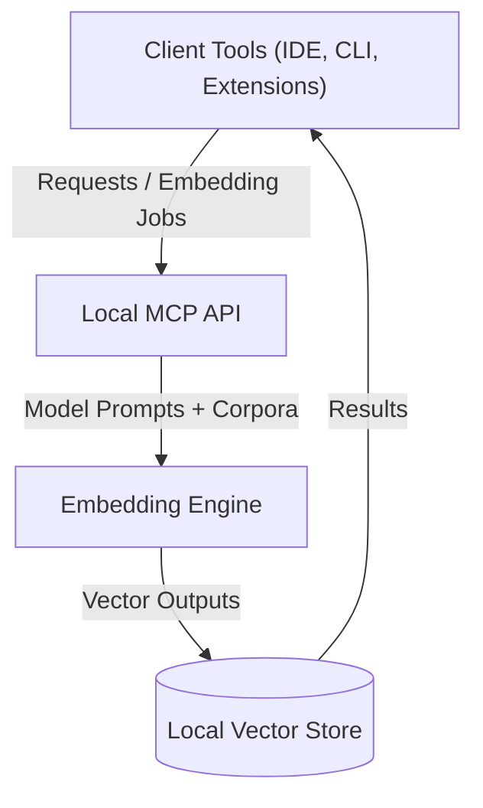

# Threat Model and Security Review Checklists

This document captures anticipated threats, guiding assumptions, and mitigation strategies for the Cursor Local Embedding MCP. It also supplies per-feature security review checklists that contributors must follow whenever they touch affected functionality.

## System Overview

The platform runs entirely within a contributor-controlled environment. Data ingestion, embedding generation, and storage stay on the local machine, minimizing external exposure but amplifying the need for strict local safeguards.

## Assumptions

- Contributors operate on trusted hosts with up-to-date OS patches and endpoint protection.
- Local filesystem permissions restrict access to project artifacts to authorized developers only.
- Embedding workloads may include sensitive customer or proprietary text requiring confidentiality.
- Network egress is firewall-controlled; only approved services are reachable when optional sync features are enabled.
- Third-party model weights and dependencies are verified before integration (e.g., checksums, signed releases).

## Threat Scenarios and Mitigations

| Threat | Description | Likelihood | Impact | Primary Mitigations |
| --- | --- | --- | --- | --- |
| Malicious prompt injection | Attackers craft prompts or documents to trigger unintended code execution or data leakage via the embedding engine. | Medium | High | Strict input validation checklist, sandboxing untrusted document parsers, limit privileged APIs exposed to embeddings. |
| Sensitive data leakage | Embeddings or intermediate artifacts expose confidential text. | Medium | High | Encrypt storage when persisted, minimize logging of raw text, redact sensitive fields before processing. |
| Dependency compromise | Supply-chain attack through malicious model weights or libraries. | Low | High | Require checksum/signature verification, maintain SBOM, pin versions, review updates. |
| Privilege escalation | Embedding service interacts with local resources beyond its mandate. | Low | Medium | Run components with least privilege, isolate filesystem access, leverage sandboxing checklist. |
| Denial of service | Large or malformed inputs exhaust CPU, memory, or disk. | Medium | Medium | Enforce rate limits, input size caps, and resource monitoring with alerting. |
| Insider misuse | Authorized user exfiltrates data or bypasses controls. | Medium | High | Maintain audit logs, enforce least privilege, review suspicious activity, document approvals for sensitive exports. |

## Mitigation Practices

- **Least privilege execution:** Run the embedding engine and auxiliary services with minimal permissions and scoped API keys.
- **Defense-in-depth logging:** Collect logs locally, redact sensitive fields, and secure log rotation to prevent tampering.
- **Secure configuration defaults:** Ship hardened defaults—encryption enabled, strict validation rules, disabled optional network sync unless explicitly required.
- **Change review discipline:** Enforce security sign-off in code reviews, referencing the checklists below.
- **Incident readiness:** Maintain runbooks for revoking credentials, rotating keys, and isolating compromised hosts.

## Security Review Checklists

Use these checklists during design discussions, implementation, and PR review whenever the associated features are touched.

### Input Validation Checklist

- [ ] Enumerate all input sources (user prompts, ingested files, API parameters) and document expected formats.
- [ ] Validate size, encoding, and schema before processing; reject malformed or excessively large payloads.
- [ ] Escape or sanitize inputs before invoking parsers, template engines, or shell commands.
- [ ] Ensure default denylists cover known dangerous patterns (e.g., shell metacharacters, path traversal sequences).
- [ ] Add negative tests for malformed payloads and verify they fail safely without leaking stack traces.
- [ ] Confirm logging omits raw sensitive input data or masks it appropriately.

### Encryption Checklist

- [ ] Identify data-at-rest and data-in-transit paths; justify any unencrypted channel.
- [ ] Use vetted cryptographic libraries with modern algorithms (AES-256-GCM, ChaCha20-Poly1305, TLS 1.3).
- [ ] Store keys in environment-specific secret managers or OS keyrings; never commit secrets to the repo.
- [ ] Implement key rotation procedures and document them in operations runbooks.
- [ ] Verify backups and exported embeddings remain encrypted and integrity-protected.
- [ ] Add automated tests or scripts confirming encryption configuration is active where applicable.

### Sandboxing Checklist

- [ ] Determine which components execute untrusted or user-supplied code (e.g., document converters, plugin hooks).
- [ ] Run risky components inside containers, VMs, or language-level sandboxes with resource limits.
- [ ] Restrict filesystem access to explicit allowlists; disallow network access unless absolutely necessary.
- [ ] Drop unnecessary capabilities (e.g., root privileges, kernel module loading) for sandboxed processes.
- [ ] Monitor sandbox escapes and enforce automatic restarts or kill switches on violation detection.
- [ ] Document sandbox policies and ensure CI validates their configuration.

## Maintaining This Document

Review and update this threat model at every release planning cycle or when architectural changes introduce new attack surfaces. Link updates in relevant PRs to keep the security posture transparent across the team.
