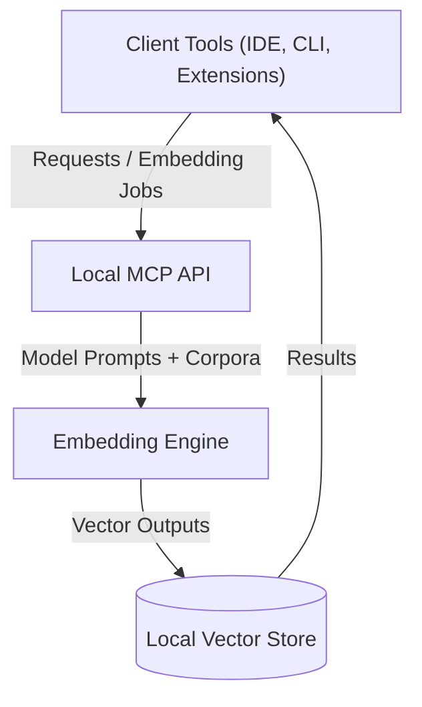

# Threat Model and Security Review Checklists

This document captures anticipated threats, guiding assumptions, and mitigation strategies for the Cursor Local Embedding MCP. It also supplies per-feature security review checklists that contributors must follow whenever they touch affected functionality.

## System Overview

The platform runs entirely within a contributor-controlled environment. Data ingestion, embedding generation, and storage stay on the local machine, minimizing external exposure but amplifying the need for strict local safeguards.

## Assumptions

- Contributors operate on trusted hosts with up-to-date OS patches and endpoint protection.
- Local filesystem permissions restrict access to project artifacts to authorized developers only.
- Embedding workloads may include sensitive customer or proprietary text requiring confidentiality.
- Network egress is firewall-controlled; only approved services are reachable when optional sync features are enabled.
- Third-party model weights and dependencies are verified before integration (e.g., checksums, signed releases).

## Threat Scenarios and Mitigations

| Threat | Description | Likelihood | Impact | Primary Mitigations |
| --- | --- | --- | --- | --- |
| Malicious prompt injection | Attackers craft prompts or documents to trigger unintended code execution or data leakage via the embedding engine. | Medium | High | Strict input validation checklist, sandboxing untrusted document parsers, limit privileged APIs exposed to embeddings. |
| Sensitive data leakage | Embeddings or intermediate artifacts expose confidential text. | Medium | High | Encrypt storage when persisted, minimize logging of raw text, redact sensitive fields before processing. |
| Dependency compromise | Supply-chain attack through malicious model weights or libraries. | Low | High | Require checksum/signature verification, maintain SBOM, pin versions, review updates. |
| Privilege escalation | Embedding service interacts with local resources beyond its mandate. | Low | Medium | Run components with least privilege, isolate filesystem access, leverage sandboxing checklist. |
| Denial of service | Large or malformed inputs exhaust CPU, memory, or disk. | Medium | Medium | Enforce rate limits, input size caps, and resource monitoring with alerting. |
| Insider misuse | Authorized user exfiltrates data or bypasses controls. | Medium | High | Maintain audit logs, enforce least privilege, review suspicious activity, document approvals for sensitive exports. |
| Transport token forgery or replay | Attackers tamper with HTTP bearer tokens, STDIO frames, or UDS credentials to bypass authentication. | Medium | High | BLAKE3-signed session envelopes with expiry, CSRF nonce enforcement, STDIO frame checksums, UDS UID allowlists, and adapter integration tests in `tests/runtime_transport/`. |

## Mitigation Practices

- **Least privilege execution:** Run the embedding engine and auxiliary services with minimal permissions and scoped API keys.
- **Defense-in-depth logging:** Collect logs locally, redact sensitive fields, and secure log rotation to prevent tampering.
- **Secure configuration defaults:** Ship hardened defaults—encryption enabled, strict validation rules, disabled optional network sync unless explicitly required.
- **Change review discipline:** Enforce security sign-off in code reviews, referencing the checklists below.
- **Incident readiness:** Maintain runbooks for revoking credentials, rotating keys, and isolating compromised hosts.
- **Instrumented transports:** Capture adapter telemetry (`http.*`, `stdio.*`, `uds.*` events) to detect anomalous authentication failures or frame validation issues in alignment with the updated transport specification.

## Mitigation Ownership and Review Cadence

The following accountability tables document who maintains each critical mitigation and how frequently the safeguards are reviewed. Reference these owners during planning, implementation, and PR review whenever work touches the listed areas.

| Mitigation Area | Primary Owner | Backup Owner | Review Cadence | Evidence Expectations |
| --- | --- | --- | --- | --- |
| Transport encryption controls (TLS configuration, certificate lifecycle) | Alex Smith (Security Officer) | Morgan Chen (Infrastructure Lead) | Monthly security sync and before any release that modifies network interfaces | TLS configuration diff, certificate rotation log, and automated transport-encryption checklist results |
| Authentication surfaces (session issuance, token validation, adapter hardening) | Alex Smith (Security Officer) | Morgan Chen (Infrastructure Lead) | Monthly security sync and prior to enabling new transports or adapters | Auth flow trace reviews, signed authentication checklist, and fuzz coverage artifacts for credential validation |
| Access control policies (capability scoping, workspace segmentation) | Jane Doe (Governance Lead) | Alex Smith (Security Officer) | Quarterly governance audit and whenever capability models change | Access policy diff, capability-mapping checklist, and governance approval notes |
| Archive extraction & file handling (sandboxing, allowed formats, decompression limits) | Priya Patel (Ingestion Lead) | Jordan Lee (Process Steward) | Bi-monthly ingestion review and whenever a new extractor or format handler is introduced | Latest sandbox validation report, extraction test suite results, and signed file-handling checklist |
| Key management lifecycle (generation, rotation, escrow procedures) | Alex Smith (Security Officer) | Priya Patel (Ingestion Lead) | Monthly security sync and prior to releases touching encryption or storage subsystems | Key rotation log, KMS policy attestation, and completed key-management checklist |
| Multi-repository isolation (workspace segmentation, credential scoping) | Jane Doe (Governance Lead) | Alex Smith (Security Officer) | Quarterly governance audit and pre-merge for cross-repo tooling changes | Access policy review notes, isolation test evidence, and approval from governance meeting minutes |

## Security Review Checklists

Use these checklists during design discussions, implementation, and PR review whenever the associated features are touched.

### Input Validation Checklist

- [ ] Enumerate all input sources (user prompts, ingested files, API parameters) and document expected formats.
- [ ] Validate size, encoding, and schema before processing; reject malformed or excessively large payloads.
- [ ] Escape or sanitize inputs before invoking parsers, template engines, or shell commands.
- [ ] Ensure default denylists cover known dangerous patterns (e.g., shell metacharacters, path traversal sequences).
- [ ] Add negative tests for malformed payloads and verify they fail safely without leaking stack traces.
- [ ] Confirm logging omits raw sensitive input data or masks it appropriately.

### Encryption Checklist

- [ ] Identify data-at-rest and data-in-transit paths; justify any unencrypted channel.
- [ ] Use vetted cryptographic libraries with modern algorithms (AES-256-GCM, ChaCha20-Poly1305, TLS 1.3).
- [ ] Store keys in environment-specific secret managers or OS keyrings; never commit secrets to the repo.
- [ ] Implement key rotation procedures and document them in operations runbooks.
- [ ] Verify backups and exported embeddings remain encrypted and integrity-protected.
- [ ] Add automated tests or scripts confirming encryption configuration is active where applicable.

### Sandboxing Checklist

- [ ] Determine which components execute untrusted or user-supplied code (e.g., document converters, plugin hooks).
- [ ] Run risky components inside containers, VMs, or language-level sandboxes with resource limits.
- [ ] Restrict filesystem access to explicit allowlists; disallow network access unless absolutely necessary.
- [ ] Drop unnecessary capabilities (e.g., root privileges, kernel module loading) for sandboxed processes.
- [ ] Monitor sandbox escapes and enforce automatic restarts or kill switches on violation detection.
- [ ] Document sandbox policies and ensure CI validates their configuration.

### Authentication Checklist

_Primary owner: Alex Smith (Security Officer); Backup: Morgan Chen (Infrastructure Lead) — see mitigation ownership table._

- [ ] Inventory every authentication surface (HTTP tokens, UDS peer credentials, STDIO shared secrets) and document supported credential types.
- [ ] Verify token signing keys or credential stores are loaded from approved secure storage before binding adapters.
- [ ] Enforce scoped capabilities on issued credentials and confirm defaults grant least privilege access paths.
- [ ] Confirm HTTP adapters enforce CSRF nonces for state-changing requests and surface telemetry for blocked attempts.
- [ ] Record failed authentication attempts with anonymized diagnostics and alert thresholds for brute-force activity.
- [ ] Add negative and fuzz tests that cover expired tokens, replay attempts, and malformed credential handshakes.
- [ ] Document session revocation flows and ensure adapters propagate revocation results to clients.

### Access Control Checklist

_Primary owner: Jane Doe (Governance Lead); Backup: Alex Smith (Security Officer) — see mitigation ownership table._

- [ ] Enumerate roles and capability bundles aligned with design requirements, documenting which commands each role may invoke.
- [ ] Validate workspace and repository scoping rules prevent cross-tenant or cross-repo leakage during routing.
- [ ] Confirm UDS transport configurations restrict `allowed_uids` to approved processes and record negotiation outcomes.
- [ ] Confirm manifest readers and vector queries enforce principal scoping and redact data outside granted capabilities.
- [ ] Add authorization regression tests for least privilege paths and attempted escalation scenarios.
- [ ] Ensure audit logs capture principal, capability, and decision rationale for every authorization event.
- [ ] Review configuration defaults to guarantee new deployments inherit hardened access policies with documented exception workflows.

### File Handling Checklist

_Primary owner: Priya Patel (Ingestion Lead); Backup: Jordan Lee (Process Steward) — see mitigation ownership table._

- [ ] Inventory all ingestion and extraction entry points, documenting allowed MIME types, extensions, and decompression limits.
- [ ] Stage archive extraction in ephemeral directories with enforced ownership, permissions, and cleanup routines.
- [ ] Validate ignore rules and path normalization guard against traversal, device files, or symlink abuse before persistence.
- [ ] Instrument extraction tooling with resource ceilings (CPU, memory, disk) and abort triggers for suspicious payloads.
- [ ] Add regression tests covering malformed archives, nested compression, and policy violations.
- [ ] Capture checklist sign-off alongside ingestion changes, including links to sandbox validation and extraction logs.

### Key Management Checklist

_Primary owner: Alex Smith (Security Officer); Backup: Priya Patel (Ingestion Lead) — see mitigation ownership table._

- [ ] Document key hierarchy (root, workspace, batch keys) and justify where each key class is generated and stored.
- [ ] Enforce automated rotation schedules and record evidence for each rotation event in the audit ledger.
- [ ] Validate keys are sealed with OS-native keyrings or hardware-backed stores; prohibit plaintext copies on disk.
- [ ] Verify backup and recovery workflows include secure key escrow with dual-control procedures.
- [ ] Add tests or scripts that fail if required keys, permissions, or policies are missing during startup.
- [ ] Review incident response playbooks for compromised keys and ensure revocation steps are tested.

## Maintaining This Document

Review and update this threat model at every release planning cycle or when architectural changes introduce new attack surfaces. Link updates in relevant PRs to keep the security posture transparent across the team.
