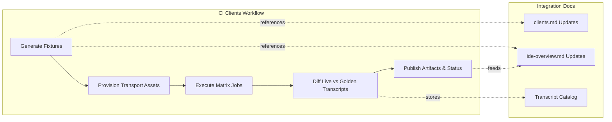

# CI Coverage Plan for Client Transport Matrix

This document describes the continuous integration (CI) coverage required before enabling
the planned language clients for the Cursor Local Embedding MCP server. It complements
the transport and envelope expectations in [`docs/integration/clients.md`](../integration/clients.md)
and the IDE automation guidance in [`docs/integration/ide-overview.md`](../integration/ide-overview.md)
so that scripted clients, IDE bridges, and CI jobs remain synchronized.

## Matrix Overview

The `clients` workflow will fan out into a matrix that exercises each language client
across the supported transport modes. All jobs run on Ubuntu, macOS, Windows, and WSL
runners unless otherwise noted.

| Job Key | Client Runtime | Transport Scenario | Runners | Notes |
| --- | --- | --- | --- | --- |
| `python-stdio-noise` | Python 3.11 | `stdio` wrapped with Noise framing | Ubuntu, macOS, Windows, WSL | Validates Noise handshake traces and transcript replay. |
| `python-http-tls` | Python 3.11 | HTTPS SSE (`http+tls`) via local terminator | Ubuntu, macOS, Windows | Uses mkcert-generated CA; skips WSL pending bridge validation. |
| `python-wsl-bridge` | Python 3.11 | `stdio` through `wsl.exe -e` bridge | Windows (host) + Ubuntu (guest) | Confirms Windows-to-WSL spawning and path translation. |
| `node-stdio-noise` | Node.js 20 | `stdio` with Noise framing | Ubuntu, macOS, Windows | Mirrors Python scenario for JS tooling. |
| `node-http-tls` | Node.js 20 | HTTPS WebSocket (`wss`) | Ubuntu, macOS, Windows, WSL | Requires ALPN + certificate pinning coverage. |
| `node-wsl-bridge` | Node.js 20 | WebSocket via Windows-hosted bridge into WSL | Windows + Ubuntu | Ensures `wsl.exe` invocation parity with IDE samples. |
| `go-stdio-noise` | Go 1.22 | `stdio` with Noise framing | Ubuntu, macOS, Windows | Exercises Go client Noise implementation. |
| `go-http-tls` | Go 1.22 | HTTPS SSE | Ubuntu, macOS, Windows, WSL | Shares TLS fixtures with Python SSE jobs. |
| `go-wsl-bridge` | Go 1.22 | `stdio` via WSL bridge | Windows + Ubuntu | Confirms Go binary launches correctly through `wsl.exe`. |

Each job performs the following phases:

1. Provision transport-specific certificates, Noise keys, or bridge scripts.
2. Replay golden transcript fixtures against the MCP server and capture live transcripts.
3. Diff live transcripts with the goldens, enforcing parity with the canonical envelopes
defined in the client integration plan.
4. Execute language linters and unit tests (`ruff`, `pytest`, `eslint`, `vitest`, `golangci-lint`, `go test`).
5. Upload transcripts, Noise handshake traces, and TLS negotiation logs as artifacts.

## Fixture and Transcript Requirements

Before enabling the matrix jobs, contributors must generate the following assets and
commit them to version control. Use the naming conventions established in the
client plan and IDE overview documents to keep parity across toolchains.

### Stdio + Noise Fixtures

- `tests/fixtures/python/stdio-noise.json`
- `tests/fixtures/node/stdio-noise.json`
- `tests/fixtures/go/stdio-noise.json`
- Noise handshake traces stored under `tests/fixtures/noise/<language>/handshake.log`.
- IDE-aligned transcripts (Cursor, Windsurf, VS Code) placed under
  `docs/integration/transcripts/ide/<ide>/stdio-noise.json` so IDE automation can
  reuse the same expectations described in the IDE overview.

### HTTP + TLS Fixtures

- `tests/fixtures/python/http-tls.json`
- `tests/fixtures/node/http-tls.json`
- `tests/fixtures/go/http-tls.json`
- Certificate bundles generated with the dev CA and stored under
  `tests/fixtures/tls/{rootCA.pem, server.pem, server-key.pem}` (private keys should
  remain encrypted at rest; use sealed secrets in CI).
- IDE bridge transcripts for HTTPS and secure websocket transports stored alongside
the stdio fixtures (`docs/integration/transcripts/ide/<ide>/http-tls.json`).
- TLS negotiation logs capturing ALPN selection and mutual TLS behavior where required.

### WSL Bridge Fixtures

- `tests/fixtures/python/wsl-bridge.json`
- `tests/fixtures/node/wsl-bridge.json`
- `tests/fixtures/go/wsl-bridge.json`
- Bridge launcher scripts (`scripts/wsl/python-client.ps1`, etc.) referenced by both
  the CI workflow and the IDE setup instructions.
- Cross-environment path translation manifests stored under
  `tests/fixtures/wsl/path-map.json`, documenting mount expectations highlighted in
the IDE overview.

## IDE Synchronization Checklist

To keep automation and documentation synchronized:

1. Update [`docs/integration/clients.md`](../integration/clients.md) whenever matrix
   combinations change so scripted clients advertise the same transport permutations.
2. Mirror IDE transport coverage in [`docs/integration/ide-overview.md`](../integration/ide-overview.md)
   by adding or updating configuration snippets for any new transport, TLS, or WSL scenarios.
3. Generate IDE golden transcripts (Cursor, Windsurf, VS Code) for each transport and
   store them next to the language fixtures referenced above.
4. Link CI artifact retention policies back into the IDE overview so developers know
   where to retrieve live transcripts during incident response.
5. Gate CI job enablement on the presence of the fixtures listed here and documented
   in the integration guides; missing assets should fail the workflow early with
   actionable errors.

## Workflow Diagram

Enable the workflow only after all fixtures, transcripts, and IDE references listed
above are present and verified locally. This guarantees that CI automation reflects
the documented client behavior and that developers can rely on the integration guides
for accurate, reproducible setup instructions.
